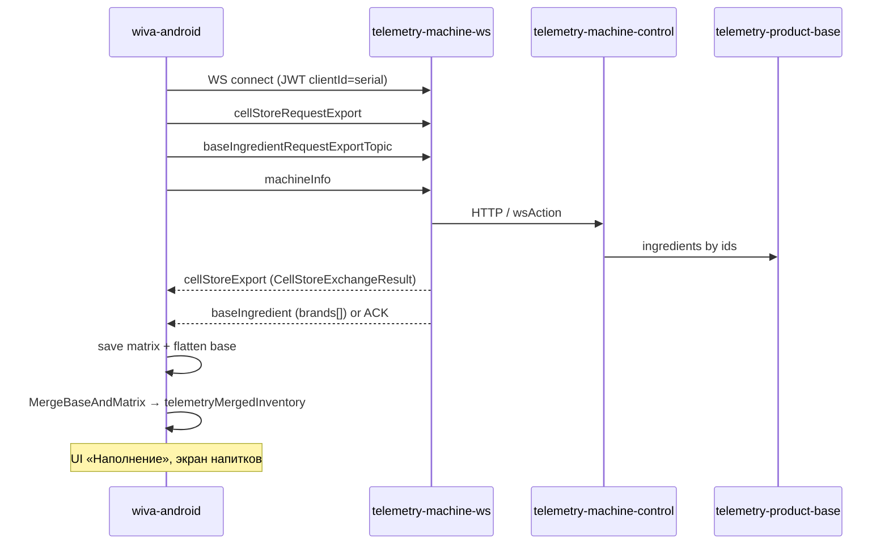
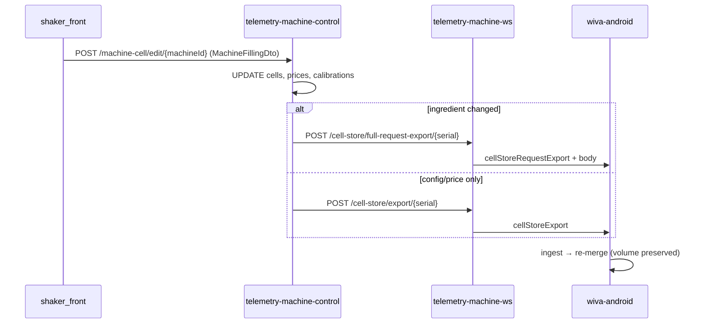
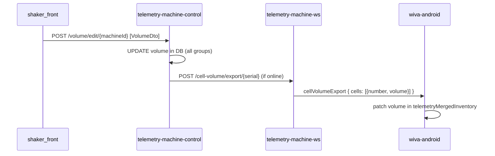

# Наполнение ячеек: запросы, автомат, БД бэкенда

> Источник правды для ТЗ wiva-android. Сводка из shaker (backend + android) / evoq_android / wiva-android.
> Дата: 2026-07-19

## 1. Контекст и границы

### Что в scope

- **Drink-автоматы** (Evoq / Wiva): продуктовые ячейки 1…6, вода, стаканы, расходники, цены, калибровка (dosage), остатки (`volume`).
- **Каналы:** REST оператора (`shaker_front` → `telemetry-machine-control`), WebSocket автомата (`telemetry-machine-ws`), Kafka import/export.
- **Локальное хранение на Android:** JsonStore в Room (`json_data`), merge base + matrix → `telemetryMergedInventory`.
- **Эталоны:** `c:\shaker\telemetry-machine-control`, `c:\shaker\telemetry-machine-ws`, `c:\shaker\evoq_android`, `c:\shaker\shaker-android\feature\telemetry-evoq`, `c:\wiva\wiva-android`.

### Что вне scope (упоминается кратко)

| Контур | Где живёт | Примечание |
|--------|-----------|------------|
| **Snack** | `machine_snack_cell_new`, топики `*Snack`, Room в shaker-android | Отдельная матрица, не merge drink |
| **Kiosk** | `/kiosk/*`, `getKioskCellsTopic` | Не в evoq/wiva-android |
| **Coffee drinks / concentrate** | `CoffeeDrinkController`, `EditCoffeeConcentrateDto` | COFFEE-модели, directSale |
| **refillFactImportTopic** | MoySklad / service maintenance | Факт пополнения, не обычный volume sync |
| **wiva-telemetry MVP** | `wiva-android` SimpleTelemetry | Регистрация/online без cell filling |
| **wiva-client-web-app** | i18n machineControl | UI наполнения в `shaker_front`, не в Wiva web |

### Базовые префиксы

- REST (gateway): `/api/telemetry-machine-control/...` → сервис `:8310`
- WS push (internal): `telemetry-machine-ws` — без `/api`
- Авторизация REST/WS: Keycloak JWT (`telemetry_auth`), WS `clientId` = serialNumber

### Разделение ответственности volume vs config

**Критическое правило бэкенда (unit-тесты):**

- `cellStoreImportTopic` — конфигурация (ingredient, prices, calibrations, limits); **не затирает** `volume`, установленный через `cellVolumeImportTopic`.
- `cellVolumeImportTopic` — только остатки (`volume`) по cells/cups/waters/disposables.

---

## 2. Полный список запросов наполнения

### 2.1 REST (operator/web → backend)

Префикс контроллеров: `/telemetry-machine-control`. Через gateway: `/api/telemetry-machine-control/...`.

#### Drink — наполнение (состав ячеек + цены + калибровка)

| Метод | Путь | Назначение | Request fields | Response | Side-effects (WS push) |
|-------|------|------------|----------------|----------|------------------------|
| **POST** | `/machine-cell/edit/{machineId}` | Изменение наполнения и цен («Матрица продаж») | `MachineFillingDto` — см. ниже | `200 OK` | Если **сменился ingredient** в любой ячейке → controller вызывает `sendCellStoreFullExport` → WS `cellStoreRequestExport` (полная матрица). Иначе → `sendCellStoreExport` → WS `cellStoreExport` |
| **POST** | `/machine-cell/edit-cell-water/{machineId}` | Параметры ячейки воды | `EditCellWaterDto` | `200 OK` | `cellStoreExport` |
| **GET** | `/machine-cell/for-check-updated/{serialNumber}` | Дата последнего изменения ячеек/цен + productIds | — | `LastUpdateAndProductIdsResult` | — |
| **GET** | `/machine-cell/list-config-machine/{serialNumber}` | Выгрузка матрицы | — | `FullCellStoreExchangeResult` | **deprecated** |
| **GET** | `/machine-cell/list-for-machine/{serialNumber}` | То же | — | `FullCellStoreExchangeResult` | **deprecated** |

**`MachineFillingDto`:**

| Поле | Тип | Описание |
|------|-----|----------|
| `cells` | `CellDto` | Ячейки всех групп |
| `prices` | `List<ChangePriceDto>` | Цены |
| `calibrations` | `Set<CalibrationDto>` | Калибровка (categoryConfigMachine) |

**`CellDto`:**

| Поле | Тип |
|------|-----|
| `cells` | `Set<MachineCellDto>` |
| `cellCups` | `Set<MachineCellCupDto>` |
| `cellWaters` | `Set<MachineCellWaterDto>` |
| `cellDisposables` | `Set<MachineCellDisposableDto>` |

**`CellDto.MachineCellDto` (продуктовая ячейка):**

| Поле | Тип | Примечание |
|------|-----|------------|
| `id` | `Integer` | PK `machine_cells.id` |
| `ingredientId` | `Integer` | FK на ingredient в product-base |
| `isActive` | `Boolean` | |
| `maxVolume` | `Integer` | |
| `minVolume` | `Integer` | |
| `expirationTimer` | `Integer` | дни → Date на бэкенде |
| `directSale` | `Boolean?` | COFFEE; null/absent → `true` |

**`CellDto.MachineCellCupDto`:**

| Поле | Тип |
|------|-----|
| `id` | `Integer` |
| `maxVolume` | `Integer` |
| `minVolume` | `Integer` |
| `isCount` | `Boolean` |
| `cupVolume` | `Integer` |

**`CellDto.MachineCellWaterDto`:**

| Поле | Тип |
|------|-----|
| `id` | `Integer` |
| `maxVolume` | `Integer` |
| `minVolume` | `Integer` |
| `isActive` | `Boolean` |
| `isCount` | `Boolean` | true = BOTTLE, false = TAP |
| `filterValue` | `Integer` |
| `expirationTimer` | `Integer` |

**`CellDto.MachineCellDisposableDto`:**

| Поле | Тип |
|------|-----|
| `id` | `Integer` |
| `name` | `String` |
| `isCount` | `Boolean` |
| `minVolume` | `Integer` |

**`ChangePriceDto`:**

| Поле | Тип |
|------|-----|
| `id` | `Integer?` | PK `prices.id` |
| `ingredientId` | `Integer?` |
| `volume` | `Integer` | объём порции (300, 700 мл…) |
| `price` | `Float` | руб |

**`CalibrationDto`:**

| Поле | Тип |
|------|-----|
| `ingredientId` | `Integer` |
| `categoryConfigMachine` | `String` | JSON-массив ключ-значение (dosage) |
| `purposeConfigMachine` | `String` |

**`EditCellWaterDto`:**

| Поле | Тип |
|------|-----|
| `type` | `WaterTypeEnum` (BOTTLE / TAP) |
| `maxVolume` | `Integer` |
| `filterValue` | `Integer` |

**`LastUpdateAndProductIdsResult`:**

| Поле | Тип |
|------|-----|
| `productIds` | `Set<Integer>` |
| `cellAndPriceUpdated` | `Instant` |

#### Drink — остатки (volume/stock)

| Метод | Путь | Назначение | Request fields | Response | Side-effects |
|-------|------|------------|----------------|----------|--------------|
| **POST** | `/volume/edit/{machineId}` | Пополнение остатков («Запасы») | `List<VolumeDto>` | `200 OK` | БД + при online WS → `cellVolumeExport` (все группы) |

**`VolumeDto` (REST):**

| Поле | Тип | Примечание |
|------|-----|------------|
| `id` | `Integer` | PK ячейки (machine_cells / cups / waters / disposables) |
| `volume` | `Integer` | мл или шт |
| `group` | `CellGroupEnum` | `POWDER`, `CONCENTRATE`, `COFFEE` → product cells; `WATER`, `CUP`, `DISPOSABLE` |

> **Расхождение с TEMP-отчётами:** в коде нет значения `PRODUCT` — продуктовые группы определяются через `GroupHelper.getProductGroup()` (POWDER/CONCENTRATE/COFFEE).

Front (`shaker_front`): `RefillMachineStorageDTO` = `[{ id, volume, group }]`.

#### Drink — цены (отдельно от edit filling)

| Метод | Путь | Request | Response | Side-effects |
|-------|------|---------|----------|--------------|
| **GET** | `/price/list/{machineId}` | — | `PriceResult` | — |
| **POST** | `/price/change/{machineId}` | `PriceAndCalibrationDto` | `200 OK` | `cellStoreExport` |

**`PriceAndCalibrationDto`:** `{ prices: ChangePriceDto[], calibrations: CalibrationDto[] }`

**`PriceResult`:**

| Поле | Тип |
|------|-----|
| `qtyDosage` | `Integer` |
| `prices` | `List<PriceList>` |

**`PriceResult.PriceList`:**

| Поле | Тип |
|------|-----|
| `productName` | `String` |
| `productLineName` | `String` |
| `brandName` | `String` |
| `ingredientId` | `Integer` |
| `cell` | `List<PriceCell>` — `{ number, view }` |
| `prices` | `List<PriceAndVolume>` — `{ id, volume, price }` |

#### Шаблоны и снапшоты наполнения

| Метод | Путь | Назначение |
|-------|------|------------|
| **GET** | `/filling-template` | Список шаблонов |
| **GET** | `/filling-template/{id}` | Шаблон по id |
| **POST** | `/filling-template/from-machine/{machineId}` | Создать из автомата |
| **PATCH** | `/filling-template/{id}/name` | Переименовать |
| **DELETE** | `/filling-template/{id}` | Удалить |
| **POST** | `/machine/{machineId}/apply-filling-template/{templateId}` | Применить шаблон + push на автомат |
| **GET** | `/machine-filling-snapshot/list/{machineId}` | Список снапшотов (ROOT) |
| **POST** | `/machine-filling-snapshot/restore/{machineId}/{snapshotId}` | Восстановить + push |

Payload шаблона/снапшота содержит JSON `cellStore` (+ snack/kiosk в шаблонах).

#### Snack (отдельный контур)

| Метод | Путь | Request | Side-effects |
|-------|------|---------|--------------|
| **GET** | `/machine-snack-cell/{machineId}` | — | Список `SnackCell` |
| **POST** | `/machine-snack-cell/edit-snack/{serialNumber}` | snack matrix DTO | push `cellStoreExportSnack` |
| **POST** | `/volume/edit-snack/{serialNumber}` | `List<SnackCellVolumeDto>` | push `cellVolumeExportSnack` |
| **POST** | `/volume/edit-snack-db/{serialNumber}` | то же | только БД |
| **GET** | `/machine-cell/get-snack/{machineId}` | — | **stub** (пустой результат) |
| **POST** | `/machine-cell/updateCellSnackMachine` | raw JSON | **deprecated** → Kafka |

**`SnackCellVolumeDto`:** `{ cellNumber, volume }`

#### Kiosk (вне wiva-android)

| Метод | Путь |
|-------|------|
| **POST** | `/kiosk/setKioskCells?machineId=` + `CellStoreExportKioskDto[]` |
| **GET** | `/kiosk/getKioskCells?machineId=` |

#### Front client (`shaker_front`)

| Метод | Путь (актуальный) | DTO |
|-------|-------------------|-----|
| edit filling | `/machine-cell/edit/{machineId}` | `EditMachineStorageDTO` |
| refill volumes | `/volume/edit/{machineId}` | `RefillMachineStorageDTO` |
| change prices | `/price/change/{machineId}` | `EditMachinePricesDTO` |

> Legacy в front: `POST /volume/edit` **без** `{machineId}` — устаревший путь; актуальный — с `machineId`.

---

### 2.2 WebSocket / Kafka topics (автомат ↔ backend)

Общая обёртка исходящих с автомата:

```json
{ "type": "<topic>", "clientId": "<serialNumber>", "body": { ... } }
```

Обёртка входящих (cellStore, baseIngredient):

```json
{ "success": true|false, "message": "...", "body": <payload>|null }
```

`body: null` — ACK без данных.

#### Автомат → сервер (import / request)

| type / Kafka topic | Направление | Body fields (все) | Что меняет на backend |
|--------------------|-------------|-------------------|------------------------|
| **`cellStoreRequestExport`** | Request (без Kafka) | — (body отсутствует) | WS action → HTTP machine-control → ответ с матрицей |
| **`baseIngredientRequestExportTopic`** | Request / Kafka pass-through | — | Запрос каталога из product-base |
| **`machineInfo`** | Request | `{}` | Метаданные автомата |
| **`cellStoreImportTopic`** | Kafka | `CellStoreExchangeResult` — см. §2.2.1 | `CellStoreService` → cells, ingredient_cells, prices, mixOfTastes, drinkingWater; **не volume** → echo `cellStoreExport` |
| **`cellVolumeImportTopic`** | Kafka | `CellVolumeDto` — см. §2.2.2 | `CellVolumeService` → UPDATE `volume` в machine_cells / cups / waters / disposables |
| **`saleImportTopic`** | Kafka | продажа + `writeOffs[]` | учёт продаж (связан со списанием) |
| **`refillFactImportTopic`** | Kafka | см. §2.2.3 | MoySklad / service maintenance |
| **`cellStoreImportTopicSnack`** | Kafka | snack matrix | snack cells |
| **`cellVolumeImportTopicSnack`** | Kafka | snack volumes | snack volume |
| **`matrixImportTopicSnack`** | Kafka | полная snack-матрица | пересборка snack |
| **`cellStoreRequestExportSnack`** | Request | — | snack variant |

#### Сервер → автомат (export / push)

| WS type | Триггер | Body |
|---------|---------|------|
| **`cellStoreExport`** | REST edit, price change, Kafka cellStoreImport echo, … | `CellStoreExchangeResult` |
| **`cellStoreRequestExport`** | Ответ на request / full-request-export | то же |
| **`cellVolumeExport`** | REST `/volume/edit`, Kafka cellVolumeImport (опц.) | `CellVolumeDto` |
| **`baseIngredientRequestExportTopic`** | onConnect / push | `BaseIngredientBrandWire[]` |
| **`cellStoreExportSnack`** | snack edit REST | snack matrix |
| **`cellVolumeExportSnack`** | snack volume REST | snack volumes |

#### 2.2.1 `CellStoreExchangeResult` (export/import body)

| Поле | Тип | Описание |
|------|-----|----------|
| `groupModel` | `String` | `MachineModelGroupEnum.name()` (напр. COFFEE) — **есть в backend, нет в wiva-android wire** |
| `products` | `Set<ProductExchangeResult>` | см. ниже |
| `cells` | `Set<CellImport>` | см. ниже |
| `cellCups` | `Set<CellCupImport>` | |
| `cellWaters` | `Set<CellWaterImport>` | |
| `cellDisposables` | `Set<CellDisposableImport>` | |
| `mixOfTastes` | `{ isActive, dosages[{ price, volume }] }` | |
| `drinkingWater` | `{ isActive, price, volume }` | из `machines.*` — **нет в wiva-android wire** |

**`ProductExchangeResult`:**

| Поле | Тип |
|------|-----|
| `ingredientId` | `Integer` |
| `cellNumbers` | `Set<Integer>` |
| `isActive` | `Boolean` |
| `prices` | `List<PriceDto>` — `{ id, volume, price }` |
| `categoryConfigMachine` | `String` (JSON) |
| `purposeConfigMachine` | `String` |

При export WS-сервис обогащает products полями из product-base: `name`, `taste`, `brand`, `ingredientLine`, `components`, `mediaKey`, … (см. `CellStoreMatrixBodyWire` в Android).

**`CellImport` (cells[]):**

| Поле | Тип | Примечание |
|------|-----|------------|
| `cellNumber` | `Integer` | |
| `volume` | `Integer?` | export включает; import **не обязан** патчить |
| `maxVolume` | `Integer` | |
| `minVolume` | `Integer` | |
| `expirationTimer` | `Date` | |
| `categoryConfigMachine` | `String?` | |
| `purposeConfigMachine` | `String?` | |
| `isActive` | `Boolean` | |
| `directSale` | `boolean` | Kafka: только явный boolean патчит |

**`CellCupImport`:** `{ cellNumber, isCount, cupVolume, maxVolume, minVolume }`

**`CellWaterImport`:** `{ cellNumber, isActive, type, maxVolume, minVolume, filterValue, expirationTimer }`

**`CellDisposableImport`:** `{ cellNumber, isCount, name, minVolume }`

#### 2.2.2 `CellVolumeDto` (Kafka / push)

| Поле | Тип | Элемент |
|------|-----|---------|
| `cells` | `Set<MachineCellKafka>` | `{ number, volume }` |
| `cellCups` | `Set<MachineCellKafka>` | `{ number, volume }` |
| `cellWaters` | `Set<MachineCellKafka>` | `{ number, volume }` |
| `cellDisposables` | `Set<MachineCellKafka>` | `{ number, volume }` |

**wiva-android uplink:** только `cells` 1…6; `cellCups`/`cellWaters`/`cellDisposables` — **всегда `[]`**.

#### 2.2.3 `refillFactImportTopic` (не путать с volume refill)

| Поле | Тип |
|------|-----|
| `requestId` | UUID string |
| `taskId` | string? |
| `organizationId` | number |
| `machineId` | number |
| `cells[]` | `{ cellNumber, cellType, productId, qtyBefore, qtyRealBeforeCheck, qtyCurrent }` |

`cellType`: `machine` | `consolidated` | `kiosk` | `snack` | `cup`

#### 2.2.4 Android uplink — `cellStoreImportTopic` body

Собирается `CellStoreImportBodyBuilder` из merge + сохранённой матрицы.

**Отправляемый `MatrixProductWire` (урезанный vs inbound):**

| Поле | В import с автомата |
|------|---------------------|
| `ingredientId`, `cellNumbers`, `prices`, `categoryConfigMachine`, `purposeConfigMachine`, `isActive` | да |
| `name`, `taste`, `brand`, … | **нет** |

**`categoryConfigMachine`** — JSON-массив:

```json
[
  {"key":"DrinkVolume","value":"300","name":"...","type":"NUMBER","description":"..."},
  {"key":"Water","value":"250",...},
  {"key":"Product","value":"30",...},
  {"key":"ConversionFactor","value":"4",...}
]
```

Ключи: `DrinkVolume`, `Water`, `Product`, `ConversionFactor` (`CategoryConfigMachineBuilder`).

#### 2.2.5 `baseIngredientRequestExportTopic` — body (массив брендов)

| Уровень | Поля |
|---------|------|
| `BaseIngredientBrandWire` | `id`, `name`, `mediaKey`, `ingredientLines[]` |
| `BaseIngredientLineWire` | `id`, `name`, `ingredients[]` |
| `BaseIngredientItemWire` | `id`, `name`, `mediaKey`, `componentOnAmount`, `components[]`, `taste`, `cellCategory`, `sportPit` |
| `MatrixComponentWire` | `id`, `name`, `qty`, `unit` |
| `MatrixTasteWire` | `id`, `name`, `mediaKey?`, `hexColor?` |

На автомате flatten → `Map<ingredientId, BaseIngredientFlatWire>`.

#### 2.2.6 Связанные топики (остатки косвенно)

**`saleImportTopic` writeOffs[]:** `{ cellNumber, ingredientId, volume, cellType: "INGREDIENT", unit: "G" }`

---

### 2.3 Внутренние HTTP push (machine-control → telemetry-machine-ws → автомат)

| Метод | Путь WS-сервиса | WS type на автомат | Body |
|-------|-----------------|-------------------|------|
| **POST** | `/cell-store/export/{serialNumber}` | `cellStoreExport` | `CellStoreExchangeResult` JSON |
| **POST** | `/cell-store/export-error/{serialNumber}` | `cellStoreExport` | error body |
| **POST** | `/cell-store/full-request-export/{serialNumber}` | `cellStoreRequestExport` | полная матрица из machine-control |
| **POST** | `/cell-volume/export/{serialNumber}` | `cellVolumeExport` | `CellVolumeDto` |
| **POST** | `/base-ingredient/export/{serialNumber}` | `baseIngredientRequestExportTopic` | brands[] |
| **POST** | `/refill-task/{serialNumber}` | `getRefillTaskTopic` | задание MoySklad |
| **POST** | `/snack/update-products/{serialNumber}` | `cellStoreExportSnack` | snack matrix |
| **POST** | `/snack/responseSnackVolume/{serialNumber}` | `cellVolumeExportSnack` | snack volumes |
| **GET** | `/ws` | WebSocket upgrade | JWT, `client_id` = serial |

---

### 2.4 Deprecated / legacy

| Endpoint / topic | Статус |
|------------------|--------|
| `GET /machine-cell/list-config-machine/{serial}` | deprecated |
| `GET /machine-cell/list-for-machine/{serial}` | deprecated |
| `GET /machine-cell/get-snack/{machineId}` | stub (пустой) |
| `POST /machine-cell/updateCellSnackMachine` | deprecated |
| `POST /volume/edit` (без machineId в front) | legacy client path |
| `cellStoreRequestExport` enum comment in Go | «пока не используется» для alternate full export — фактически используется через full-request-export |

---

## 3. Итоговое состояние данных

### 3.1 БД бэкенда (PostgreSQL / telemetry-machine-control)

#### Drink

| Таблица / entity | Ключевые поля | Роль |
|------------------|---------------|------|
| **`machine_cells`** / `MachineCell` | `id`, `cell_number`, `volume`, `max_volume`, `min_volume`, `is_active`, `direct_sale`, `cell_group`, `view`, `expiration_timer`, `cell_category_id`, `cell_purpose_id`, FK `machine_id`, FK `ingredient_cell_id` | **Ячейка** + **остаток** `volume` |
| **`ingredient_cells`** / `IngredientCell` | `id`, `ingredient_id`, `is_active`, `category_config_machine` (text JSON), `purpose_config_machine`, `is_sale_off` | Связь **ингредиент ↔ ячейки**; dosage в JSON |
| **`prices`** / `Price` | `id`, `price` (float), `volume` (int), FK `ingredient_cell_id` | **Цены** по объёмам порций |
| **`machine_cell_waters`** / `MachineCellWater` | `cell_number`, `volume`, `type`, `max/min_volume`, `is_active`, `filter_value`, `expiration_timer` | Вода + остаток |
| **`machine_cell_cups`** / `MachineCellCup` | `cell_number`, `volume`, `cup_volume`, `is_count`, `max/min_volume` | Стаканы + остаток |
| **`machine_cell_disposables`** / `MachineCellDisposable` | `cell_number`, `volume`, `name`, `is_count`, `min_volume` | Расходники + остаток |
| **`machines`** / `Machine` | `drinking_water_price`, `drinking_water_volume`, `is_active_drinking_water`, `is_active_mixed_tastes`, `filling_template_*` | Питьевая вода, mix of tastes |
| **`mixed_taste_dosages`** / `MixedTasteDosage` | `price`, `volume`, FK machine | Mix of tastes |
| **`machine_filling_snapshots`** | `machine_id`, `created_at`, `source`, `payload` (JSON) | История наполнения |

**Семантика:**

- **«Ячейка» (config):** `machine_cells` (+ cups/waters/disposables) + привязка `ingredient_cell`.
- **«Цена»:** строки `prices` на `ingredient_cell_id` (не на номер ячейки напрямую); маппинг ingredient → `cellNumbers` через products в cellStore.
- **«Остаток»:** поле `volume` в соответствующей таблице ячейки.

Каталог ингредиентов — **`telemetry-product-base`** (`ingredients`, lines, components, media).

#### Snack (отдельно)

| Таблица | Поля |
|---------|------|
| **`machine_snack_cell_new`** / `SnackCell` | `id` (UUID), `cell_number`, `row_number`, `price`, `product_id`, `volume`, `max_volume`, `min_volume`, `size`, `is_active`, `is_promo_enabled`, `original_price` |

---

### 3.2 Автомат (Android JsonStore / merge)

Хранилище: Room `json_data` (`JsonStoreEntity`: `name`, `data`). SharedPreferences для inventory **не используются**.

#### Ключи JsonStore (drink)

| Ключ | Содержимое | Когда пишется |
|------|------------|---------------|
| `telemetryBaseIngredients` | `BaseIngredientsFileWire` — `Map<string, BaseIngredientFlatWire>` | После `baseIngredientRequestExportTopic` |
| `telemetryCellStoreMatrix` | `CellStoreMatrixBodyWire` (сырая матрица) | После `cellStoreExport` / `cellStoreRequestExport` |
| `telemetryMergedInventory` | `StoredMachineConfigWire` — итог merge | После merge, списания, ручного edit, `cellVolumeExport` |
| `machineRegistration` | serial, orgId, machineId | `machineInfo` |
| `water_usage_ml` | string (double) | аппаратный счётчик воды (не ячейка) |
| `water_calibration` | JSON калибровки воды | G1 |

Parity keys в `shaker-android/feature/telemetry-evoq`: `EvoqInventoryPersistence.Keys` — те же три telemetry-ключа.

#### Схема `StoredMachineConfigWire` (merged inventory)

**`containers[]` / `StoredContainerWire`:**

| Поле | Описание |
|------|----------|
| `containerNumber` | Номер ячейки (1…6) |
| `volume` | **Остаток, мл** |
| `minVolume`, `maxVolume` | Пороги из матрицы |
| `isActive`, `hasSmallDrink` | Флаги |
| `catalogTitle` | «Бренд · линия · продукт» |
| `cup` | `{ name, mediaKey, id }` |
| `product` | см. ниже |

**`StoredProductWire`:**

| Поле | Описание |
|------|----------|
| `id` | ingredientId |
| `name`, `condition` ("Powder") | |
| `taste` | `{ id, name, hexColor, mediaKey }` |
| `producingCompany` | `{ id, name, mediaKey }` |
| `componentOnAmount`, `components[]` | |
| `dPrices[]` | `{ volume, price }` — **цены 300/700 мл** |
| `dosage` | `{ conversionFactor, drinkVolume, product, water }` |

#### Merge-логика (`MergeBaseAndMatrix`)

1. `base[ingredientId]` + `matrix.products/cells`.
2. Парсит `categoryConfigMachine` → dosage.
3. Цены: 1 price → дублирует на 300 и 700; ≥2 → сортировка по price → min→300, max→700.
4. Сохраняет `volume/min/max` из предыдущего merge при re-merge.
5. Новые ячейки без preserved → `volume = 0`.

**Не попадает в merge (остаётся только в `telemetryCellStoreMatrix`):** `cellWaters`, `cellCups`, `cellDisposables`, `mixOfTastes`, `drinkingWater`, `groupModel`.

#### Что обновляется после каждого типа запроса (на автомате)

| Событие | `telemetryBaseIngredients` | `telemetryCellStoreMatrix` | `telemetryMergedInventory` | Uplink |
|---------|------------------------------|------------------------------|------------------------------|--------|
| `baseIngredient*` inbound | ✓ | — | re-merge | — |
| `cellStore*` inbound | — | ✓ | re-merge | — |
| `cellVolumeExport` inbound | — | — | patch `volume` only | — |
| Ручной edit остатков (UI) | — | — | ✓ | `cellVolumeImportTopic` |
| Списание / cook SUCCESS | — | — | ✓ deduct | `cellVolumeImportTopic` + `saleImportTopic` |
| Калибровка сиропа | — | — | ✓ CF | `cellVolumeImportTopic` + `cellStoreImportTopic` |

---

### 3.3 Сводка «после наполнения что где лежит»

| Сущность | Автомат (JsonStore merge) | БД backend | Канал синхронизации |
|----------|---------------------------|------------|---------------------|
| Состав ячеек (ingredient ↔ cell#) | `containers[].product.id`, matrix `products` | `machine_cells` + `ingredient_cells` | `cellStoreExport` ↓ / `cellStoreImportTopic` ↑ / REST `machine-cell/edit` |
| Цены 300/700 | `containers[].product.dPrices[]` | `prices` (via ingredient_cell) | `cellStore*` (нет отдельного price-topic) |
| Dosage / CF | `containers[].product.dosage` | `ingredient_cells.category_config_machine` | `cellStoreImportTopic` / REST calibrations |
| min/max ячейки | `containers[].min/maxVolume` | `machine_cells.max/min_volume` | `cellStore*` |
| **Остаток продукта** | `containers[].volume` | `machine_cells.volume` | `cellVolumeExport` ↓ / `cellVolumeImportTopic` ↑ / REST `/volume/edit` |
| Остаток cup/water/disposable | только в raw matrix; uplink **не шлёт** | `machine_cell_*`.volume | REST `/volume/edit` → full `cellVolumeExport`; backend Kafka принимает все 4 массива |
| Питьевая вода (цена/объём) | **не в merge** | `machines.drinking_water_*` | `cellStoreExport.drinkingWater` |
| Mix of tastes | raw matrix only | `mixed_taste_dosages` + `machines.is_active_mixed_tastes` | `cellStore*` |
| Snack matrix/volume | Room snack (shaker-android) | `machine_snack_cell_new` | `*Snack` topics / REST snack |

---

## 4. End-to-end сценарии

### 4.1 Первичная выгрузка матрицы на автомат



Порядок: matrix может прийти раньше base → merge частичный; после `cellStoreExport` — retry base если пуста.

### 4.2 Изменение наполнения/цен из веба



Отдельно: `POST /price/change/{machineId}` → только `cellStoreExport`.

### 4.3 Пополнение остатков из веба



### 4.4 Пополнение остатков из сервисного меню автомата

1. UI вкладка «Остатки» → `applyCellVolumes`.
2. Save `telemetryMergedInventory`.
3. `sendCellVolumeImportFromConfig()` → WS `cellVolumeImportTopic` (cells 1…6).
4. WS → Kafka → `CellVolumeService` → UPDATE DB.
5. При online возможен echo `cellVolumeExport` (не обязателен).

«До полного» → set volume = maxVolume → тот же uplink.

### 4.5 Калибровка / import матрицы с автомата

1. `SyrupCalibrationService.submitCalibrationResult` → update `conversionFactor` в merge.
2. Uplink: `cellVolumeImportTopic` + `cellStoreImportTopic` (body from `CellStoreImportBodyBuilder`).
3. Kafka → `CellStoreService` → DB prices/calibrations → echo `cellStoreExport`.
4. Автомат re-ingest → re-merge.

### 4.6 Списание при продаже

1. Cook SUCCESS → `InventoryService.applyWriteOff` → `deductContainerVolume` (мл продукта локально).
2. `cellVolumeImportTopic` → backend volume.
3. `saleImportTopic` с `writeOffs[{ cellNumber, ingredientId, volume, unit:"G" }]`.
4. Stop-gate UI: `volumeMl < minVolumeMl` → unavailable.

---

## 5. Состояние в wiva-android сейчас

| Компонент | Статус vs evoq/shaker | Примечание |
|-----------|----------------------|------------|
| WS inbound: `cellStore*`, `baseIngredient*`, `cellVolumeExport` | **Портировано** | `ViwaTelemetryService` + `MachineInventoryRepositoryImpl` |
| Merge base + matrix | **Портировано** | `MergeBaseAndMatrix.kt` — parity evoq |
| JsonStore keys | **Портировано** | `JsonStoreKeys.kt` = evoq |
| WS uplink: `cellVolumeImportTopic` | **Портировано** | только cells 1…6, cups/waters/disposables `[]` |
| WS uplink: `cellStoreImportTopic` | **Портировано** | после калибровки сиропа |
| `saleImportTopic` + writeOffs | **Портировано** | после cook / Pax |
| UI «Наполнение» (read-only) | **Портировано** | `ViwaTelemetryInventoryTab` |
| UI «Остатки» (edit volume) | **Портировано** | `ViwaInventoryVolumesTab` |
| Customer catalog from merge | **Портировано** | `DrinkListViewModel` — без merge пусто |
| REST cell filling/refill | **Отсутствует** (by design) | только WS legacy |
| Snack inventory | **Отсутствует** | не в scope Wiva drink |
| `groupModel`, `drinkingWater` в wire | **Отсутствует** | backend шлёт; Kotlin `CellStoreMatrixBodyWire` не парсит |
| cup/water/disposable в merge | **Stub** | raw matrix сохраняется; merge не использует |
| MVP protocol (`useMvpProtocol=true`) | **Stub** | `skipLegacyTopic` — **все** cell/inventory топики отключены |
| Offline queue для import | **Отсутствует** | локальные изменения без auto-retry |
| Unit-тесты JSON import/export | **Отсутствует** | TODO в G2 summary |
| `TELEMETRY_EXCHANGES_INVENTORY.md` | **Устарел** | помечает merge как «этап E / Log» — уже реализовано |
| shaker-android hybrid drink inbound | **Не wired** | uplink only; snack wired в Room |

**Parity evoq_android ↔ wiva-android:** контракт наполнения практически идентичен (`com.viwa.android` vs `com.shaker.evoq`); отличия — оплата, брендинг, MVP telemetry flag.

---

## 6. Gaps и открытые вопросы для ТЗ

1. **MVP WS:** нужен ли новый протокол cell filling или всегда legacy для production Wiva?
2. **Полный `CellVolumeDto` uplink:** передавать cup/water/disposable или Wiva hardware их не учитывает?
3. **`groupModel` / `directSale` / `drinkingWater`:** нужны ли в merge/UI Wiva (COFFEE/hybrid gating)?
4. **Race offline:** двусторонний refill (web push vs machine uplink) без очереди/idempotency на клиенте.
5. **6 ячеек hardcoded** в `sendCellVolumeImportFromConfig` — параметризовать по модели?
6. **`saleImportTopic` unit G vs local deduct ml** — сверка с backend/electron (wiva_electron не в workspace).
7. **Water usage:** TZ G4 (`WATER_USAGE_ML` из dosage) vs реализация через `ViwaWaterCounterService`.
8. **Snack / kiosk:** явно out of scope Wiva v1 или phase 2?
9. **Filling templates / snapshots:** нужен ли UI/REST на стороне Wiva или только consume WS?
10. **Документация:** обновить `TELEMETRY_EXCHANGES_INVENTORY.md` под фактическую реализацию merge.
11. **Тесты:** golden JSON `cell_store_import_topic`, `cell_volume_import_topic` (как в shaker-android telemetry-evoq).
12. **refillFactImportTopic:** нужен ли service maintenance flow в Wiva?

---

## 7. Ключевые пути исходников

### Backend (shaker)

| Область | Путь |
|---------|------|
| REST filling | `c:\shaker\telemetry-machine-control\src\main\java\su\shaker\telemetrymachinecontrol\controller\MachineCellController.java` |
| REST volumes | `...\controller\VolumeController.java` |
| REST prices | `...\controller\PriceController.java` |
| REST snack | `...\controller\MachineSnackCellController.java` |
| DTO filling | `...\service\machine\machineCell\dto\MachineFillingDto.java`, `CellDto.java`, `ChangePriceDto.java`, `CalibrationDto.java`, `EditCellWaterDto.java` |
| DTO volume Kafka | `...\dto\kafka\CellVolumeDto.java` |
| Export/import result | `...\result\CellStoreExchangeResult.java`, `ProductExchangeResult.java`, `FullCellStoreExchangeResult.java` |
| Kafka consumers | `...\kafka\CellStoreService.java`, `CellVolumeService.java` |
| Edit + push logic | `...\MachineCellEditService.java`, `CellStoreExchangeService.java`, `VolumeService.java` |
| Entities | `...\entity\MachineCell.java`, `IngredientCell.java`, `Price.java`, `MachineCellWater.java`, `MachineCellCup.java`, `MachineCellDisposable.java`, `SnackCell.java`, `Machine.java` |
| WS routes | `c:\shaker\telemetry-machine-ws\internal\config\route.go` |
| WS topic enum | `c:\shaker\telemetry-machine-ws\internal\util\enum\constEnum.go` |
| WS flow doc | `c:\shaker\telemetry-machine-ws\docs\WEBSOCKET_FLOW.md` |
| Refill fact contract | `c:\shaker\telemetry-machine-ws\docs\refill-fact-import-topic-contract.md` |
| Front DTO | `c:\shaker\shaker_front\src\types\serverInterface\machineDTO.ts` |
| Front API | `c:\shaker\shaker_front\src\app\api\modules\machineControl\machineControlModule.ts` |

### evoq_android (эталон автомата)

| Область | Путь |
|---------|------|
| WS service | `c:\shaker\evoq_android\app\src\main\java\com\shaker\evoq\services\telemetry\EvoqTelemetryService.kt` |
| Inventory repo | `...\data\repository\MachineInventoryRepositoryImpl.kt` |
| Wire models | `...\data\telemetry\inventory\MachineInventoryModels.kt` |
| Merge | `...\domain\telemetry\MergeBaseAndMatrix.kt` |
| Import builder | `...\services\telemetry\CellStoreImportBodyBuilder.kt` |
| Json keys | `...\data\local\db\JsonStoreKeys.kt` |
| Docs | `c:\shaker\evoq_android\docs\TELEMETRY_EXCHANGES_INVENTORY.md`, `TZ_G_CALIBRATION_COOKING_INVENTORY.md` |

### wiva-android (целевой проект)

| Область | Путь |
|---------|------|
| WS service | `c:\wiva\wiva-android\app\src\main\java\com\wiva\android\services\telemetry\ViwaTelemetryService.kt` |
| Import builder | `...\services\telemetry\CellStoreImportBodyBuilder.kt` |
| Inventory repo | `...\data\repository\MachineInventoryRepositoryImpl.kt` |
| Wire models | `...\data\telemetry\inventory\MachineInventoryModels.kt` |
| Merge | `...\domain\telemetry\MergeBaseAndMatrix.kt` |
| categoryConfigMachine | `...\domain\telemetry\CategoryConfigMachineBuilder.kt` |
| Json keys | `...\data\local\db\JsonStoreKeys.kt` |
| Write-off | `...\services\inventory\InventoryService.kt`, `InventoryWriteOffMath.kt` |
| UI | `...\ui\screens\service\tabs\ViwaTelemetryInventoryTab.kt`, `ViwaInventoryVolumesTab.kt` |
| Docs (смежные) | `c:\wiva\wiva-android\docs\TELEMETRY_EXCHANGES_INVENTORY.md`, `TZ_G_CALIBRATION_COOKING_INVENTORY.md` |

### shaker-android (hybrid / snack reference)

| Область | Путь |
|---------|------|
| Evoq inventory keys | `c:\shaker\shaker-android\feature\telemetry-evoq\src\main\java\com\shaker\feature\telemetry\evoq\inventory\EvoqInventoryPersistence.kt` |
| Snack hybrid TZ | `c:\shaker\shaker-android\docs\agents\hybrid-cell-stock\tz.md` |

---

## Приложение: REST регистрация (не filling, но prerequisite)

| Client | POST path | Body |
|--------|-----------|------|
| wiva-android | `/api/telemetry-machine-control/machine/registration/{regKey}` | `{ modelName: "WIVA", machineName: "WIVA", serialNumber }` → `{ secretKey, type }` |
| evoq_android | то же | `{ modelName: "EVOQ", ... }` |

Без WS auth (Keycloak client_credentials) синхронизация наполнения невозможна.
