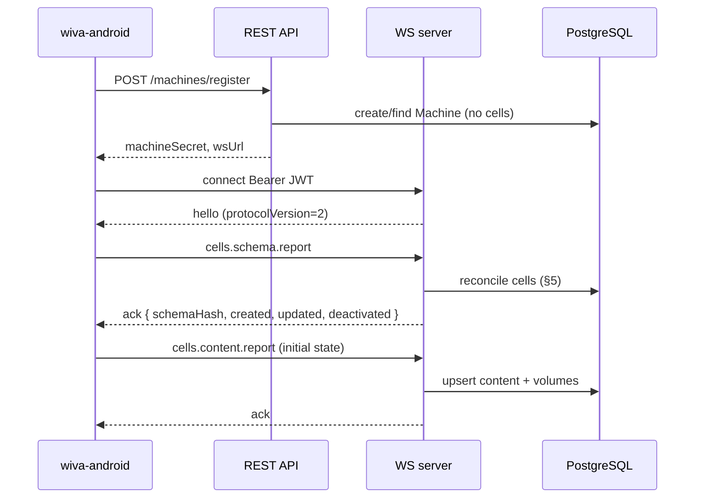
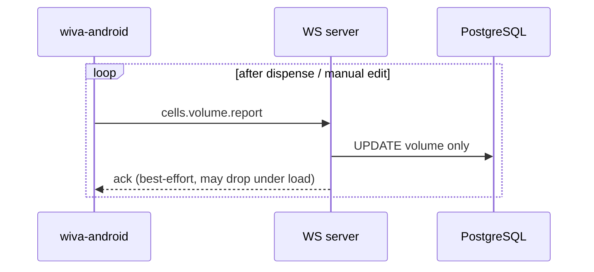
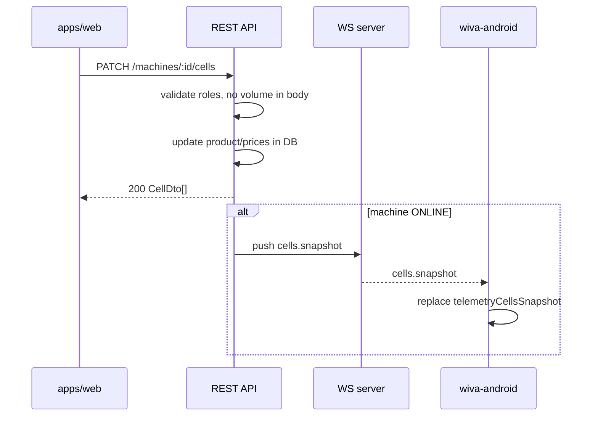

# Feature: Machine cells inventory (Wiva)

> Проект фичи для ТЗ/реализации. Дата: 2026-07-19  
> Repos: wiva-android, wiva-telemetry (api + web)

## 1. Цель и границы

### Цель

Дать оператору на **странице автомата** (`wiva-telemetry/apps/web`) видимость остатков по продуктовым ячейкам и возможность менять **содержимое** (продукт) и **цены** (dosage1/dosage2). Автомат (`wiva-android`) синхронизирует состояние с бэкендом через **MVP WebSocket** (не Shaker Kafka/legacy topics).

### In scope

| # | Требование |
|---|------------|
| 1 | Web: таблица ячеек — остатки, продукт, цены, пороги block/sos |
| 2 | Web: редактирование product + dosage1Price/dosage2Price (+ structural fields по политике) |
| 3 | Web: **отдельный раздел «База продуктов»** — CRUD таблицы продуктов (название + вкус) |
| 4 | Два uplink-типа автомат → телеметрия: (a) volume-only, (b) content (+ volumes желательно) |
| 5 | После регистрации ячейки **не создаются** на сервере; автомат шлёт **schema report** → backend reconcile |
| 6 | Частые volume-updates — **low-priority consistency** (best-effort, без строгого ordering) |
| 7 | Flat cell model: uuid, productUuid, blockVolume, sosVolume, volume, maxVolume, dosage1Price, dosage2Price, cellNumber |

### Out of scope

- Стаканы, расходники, вода, mixOfTastes, categoryConfigMachine / калибровка CF (отдельная фича)
- Shaker legacy (`telemetry-machine-control`, Kafka import topics, `wiva-client-web-app`)
- Snack / kiosk / coffee concentrate
- Продажи, рецепты, списание при cook (интеграция позже; uplink volume report готовит почву)

### Референс legacy (только справочно)

Поведение Shaker/Evoq (split volume vs store, REST edit, merge base+matrix):  
[`CELL_FILLING_REQUESTS_AND_STORAGE.md`](./CELL_FILLING_REQUESTS_AND_STORAGE.md) — **не** целевой протокол Wiva.

---

## 2. As-is: насколько текущий код подходит

### 2.1 wiva-android

**Есть (legacy merge / StoredContainerWire):**

| Target field | Текущее | Файлы |
|--------------|---------|-------|
| `cellNumber` | `StoredContainerWire.containerNumber` | `MachineInventoryModels.kt`, merge |
| `volume` | `StoredContainerWire.volume` (мл, Int) | `ingestCellVolumeExport`, UI tabs |
| `maxVolume` | `StoredContainerWire.maxVolume` | merge из `MatrixCellWire` |
| `dosage1Price` / `dosage2Price` | `StoredProductWire.dPrices[]` → price300/700 | `MergeBaseAndMatrix.kt`, `MachineInventoryTableRow.kt` |

**Нет:**

- `uuid`, `productUuid` (только `ingredientId: Int`)
- `blockVolume`, `sosVolume` (есть `minVolume` как stop-gate, семантика другая)
- Schema uplink после register
- MVP cell sync: при `useMvpProtocol=true` (default) все legacy topics **no-op** (`skipLegacyTopic`)

**Legacy WS (Shaker envelope, не MVP):**

- Uplink (a): `cellVolumeImportTopic` — `{ number, volume }`, hardcoded cells 1..6
- Uplink (b): `cellStoreImportTopic` — content **без** volume в одном сообщении
- Downlink: `cellStoreExport`, `cellVolumeExport` — без UUID/block/sos
- Initial sync: `cellStoreRequestExport` — **pull** матрицы с сервера, не push schema

**Хранение:** три JsonStore-ключа (`telemetryBaseIngredients`, `telemetryCellStoreMatrix`, `telemetryMergedInventory`).

### 2.2 wiva-telemetry (+ web)

**БД (Prisma):** `users`, `sessions`, `machines`, `registration_keys`, … — **нет** `products`, `machine_cells`.

**WS v1:** envelope `{ type, messageId, sentAt, payload?, correlationId? }`; типы: `hello`, `heartbeat`, `ack`, `error`.

**REST:** register, token, list/detail machines, allow-rebind — **нет** cells/products.

**Web (`apps/web`):** `MachineDetailPage` — telemetry + rebind; **нет** inventory UI.

**Non-goals MVP** (`docs/agents/simple-telemetry-mvp/brief.md`): «Продажи, остатки, рецепты».

### 2.3 Mapping target ↔ current

| Target | wiva-android | wiva-telemetry |
|--------|--------------|----------------|
| `uuid` | нет | нет (PK будет server-side или client-generated) |
| `productUuid` | `ingredientId: Int` | нет Product table |
| `cellNumber` | ✓ | нет |
| `volume`, `maxVolume` | ✓ | нет |
| `blockVolume`, `sosVolume` | нет | нет |
| `dosage1Price`, `dosage2Price` | частично (300/700 ml) | нет |
| volume-only uplink | legacy topic | нет handler |
| content uplink | legacy topic (без volume) | нет handler |
| schema after register | нет (pull matrix) | нет |
| web cells UI | service menu only (local) | нет |

### 2.4 Оценка объёма изменений

| Слой | Уровень | Оценка | Комментарий |
|------|---------|--------|-------------|
| **wiva-telemetry backend** | Medium → Big Rock | **8–12 d** | Prisma, REST, WS handlers, dedup, push, tests |
| **wiva-telemetry web** | Medium | **4–6 d** | Machine detail cells section, product select, PATCH |
| **wiva-android** | **Large** | **5–8 d** (MVP path) / **25–40 файлов** (UUID-first + замена merge) | Новые MVP types + `telemetryCellsSnapshot`; legacy за `useMvpProtocol=false` |
| **E2E + contracts** | | **2–3 d** | register → schema → web edit → push → volume reports |

**Итого stack:** ~3–4 недели одного разработчика. Backend+web без Android: ~2 недели.

**Рекомендация Android:** новые MVP message types + один JsonStore `telemetryCellsSnapshot`; legacy Shaker inventory оставить за flag до удаления.

---

## 3. Целевая модель данных

### 3.1 Domain Cell

Единица инвентаря — **одна физическая продуктовая ячейка** автомата.

```typescript
interface Cell {
  uuid: string;              // stable id (генерируется на автомате при первом schema report, сохраняется навсегда)
  cellNumber: number;        // 1..N, уникален в рамках machine
  productUuid: string | null; // FK на Product; null = пустая ячейка
  blockVolume: number;       // мл — порог блокировки продажи (см. §3.1.1)
  sosVolume: number;         // мл — порог предупреждения «мало» (см. §3.1.1)
  volume: number;            // мл — текущий остаток
  maxVolume: number;         // мл — ёмкость ячейки
  dosage1Price: number | null; // копейки (int), цена малой порции
  dosage2Price: number | null; // копейки (int), цена большой порции
}
```

#### 3.1.1 Семантика blockVolume / sosVolume

| Поле | Смысл | UI (web + service menu) | Продажа (Android, позже) |
|------|-------|---------------------------|---------------------------|
| `blockVolume` | Жёсткий порог: при `volume <= blockVolume` ячейка **недоступна** для продажи | Красный индикатор / «стоп» | Cook gate: block |
| `sosVolume` | Мягкий порог: при `volume <= sosVolume` (но > blockVolume) — **warning**, продажа возможна | Жёлтый индикатор / «мало» | Warning в UI, optional telemetry event |

Порядок: `0 <= blockVolume <= sosVolume <= maxVolume` (валидация на API). Default при создании: `blockVolume=0`, `sosVolume=0` (нет порогов до явной настройки).

#### 3.1.2 Единицы цен — **решение: int копейки везде**

| Слой | Тип | Пример |
|------|-----|--------|
| WS payload | `Int` копейки | `9900` = 99.00 ₽ |
| REST JSON | `Int` копейки | `{ "dosage1Price": 9900 }` |
| PostgreSQL | `Int` (`dosage1_price`, `dosage2_price`) | без Decimal/float drift |
| Android stored model | `Int` | как legacy `price: Int` в dPrices |

Web UI форматирует для человека (`9900 → "99,00 ₽"`). **Не** использовать Decimal в БД для этой фичи — единый int end-to-end.

Объёмы — **мл, Int**, non-negative.

### 3.1.3 Domain Product (база продуктов)

Отдельный каталог для выбора содержимого ячейки. **Не** Shaker product-base.

```typescript
interface Product {
  uuid: string;
  name: string;
  tasteMediaKey: TasteMediaKey; // один из 14 ключей Android (см. §3.1.4)
}
```

CRUD: создание / редактирование / удаление. При создании и редактировании: ввод **названия** + выбор **вкуса** из allowlist.

### 3.1.4 Allowlist вкусов (из wiva-android)

Канон: `ViwaElectronAssets.kt` → `MEDIA_KEY_TO_PNG` / `MEDIA_KEY_TO_VIDEO`  
(ассеты: `app/src/main/assets/viwa_electron/img/horizontalCard/*.png`).

| `tasteMediaKey` | Отображаемое имя (RU) |
|-----------------|------------------------|
| `cherry` | Чёрная вишня |
| `blackberry-lime` | Ежевика-лайм |
| `coconut` | Кокос |
| `cucumber` | Огурец |
| `grapefruit` | Грейпфрут |
| `lemon` | Лимон |
| `lime` | Лайм |
| `lime-mint` | Лайм-мята |
| `orange` | Апельсин |
| `peach-mango` | Манго-персик |
| `pomegranate-blueberry` | Гранат-черника |
| `raspberry` | Малина |
| `strawberry-lemongrass` | Клубника-лемонграсс |
| `watermelon` | Арбуз |

API/БД хранят **строковый** `tasteMediaKey`. Значение вне списка → `400 INVALID_TASTE`.  
Автомат использует тот же ключ для PNG/видео карточки напитка.

### 3.2 PostgreSQL / Prisma schema

```prisma
model Product {
  id            String   @id @default(uuid())
  name          String
  tasteMediaKey String   @map("taste_media_key") // one of 14 allowlisted keys
  createdAt     DateTime @default(now()) @map("created_at")
  updatedAt     DateTime @updatedAt @map("updated_at")

  cells MachineCell[]

  @@index([tasteMediaKey])
  @@map("products")
}

model MachineCell {
  id             String   @id // uuid from machine schema report OR server-generated on first reconcile
  machineId      String   @map("machine_id")
  cellNumber     Int      @map("cell_number")

  productId      String?  @map("product_id")

  blockVolume    Int      @default(0) @map("block_volume")
  sosVolume      Int      @default(0) @map("sos_volume")
  volume         Int      @default(0)
  maxVolume      Int      @map("max_volume")

  dosage1Price   Int?     @map("dosage1_price")   // kopecks
  dosage2Price   Int?     @map("dosage2_price")   // kopecks

  isActive       Boolean  @default(true) @map("is_active")  // false = removed from machine schema
  schemaRevision Int      @default(1) @map("schema_revision")

  createdAt      DateTime @default(now()) @map("created_at")
  updatedAt      DateTime @updatedAt @map("updated_at")

  machine Machine  @relation(fields: [machineId], references: [id], onDelete: Cascade)
  product Product? @relation(fields: [productId], references: [id], onDelete: SetNull)

  @@unique([machineId, cellNumber])
  @@index([machineId])
  @@index([machineId, isActive])
  @@index([productId])
  @@map("machine_cells")
}

model MachineWsMessageDedup {
  machineId  String   @map("machine_id")
  messageId  String   @map("message_id")
  receivedAt DateTime @default(now()) @map("received_at")

  @@id([machineId, messageId])
  @@index([receivedAt])
  @@map("machine_ws_message_dedup")
}
```

**Расширение `Machine`:**

```prisma
model Machine {
  // ... existing fields ...
  cellSchemaHash     String?   @map("cell_schema_hash")
  cellSchemaSyncedAt DateTime? @map("cell_schema_synced_at")
  cells              MachineCell[]
}
```

### 3.3 Source of truth rules

| Поле / аспект | Источник правды | Правило |
|---------------|-----------------|---------|
| Structural: `uuid`, `cellNumber`, `maxVolume`, `blockVolume`, `sosVolume` | **Machine** schema report | Backend reconcile; web может править block/sos/max **если политика разрешит** (MVP: web read-only structural, правки только с автомата) |
| Content: `productUuid`, `dosage1Price`, `dosage2Price` | **Last writer wins** с приоритетом: dashboard PATCH > machine `cells.content.report` | Volume-only **никогда** не меняет product/prices |
| `volume` | **Machine** (dispense, refill, calibration) | Web **не** PATCH volume в MVP (см. REST); optional admin refill — v1 |
| Schema existence | **Machine** после register | Backend не создаёт ячейки при `POST /register` |
| Consistency | — | Volume reports частые — **at-least-once**, порядок не гарантируется; dedup по `messageId` |

**Критическое правило (из legacy, сохраняем):**

- `cells.volume.report` → UPDATE **только** `volume` (+ optional block/sos если пришли в том же patch — см. open question)
- `cells.content.report` → upsert product + prices + maxVolume + volumes если переданы
- Dashboard `PATCH /cells` → content/prices (+ structural если разрешено); **не** volume

---

## 4. Протоколы обмена

Envelope MVP (без изменений формы):

```json
{
  "type": "cells.volume.report",
  "messageId": "550e8400-e29b-41d4-a716-446655440000",
  "sentAt": "2026-07-19T10:00:00.000Z",
  "payload": { }
}
```

Ответ: `ack` с `correlationId = messageId` или `error`.

**Protocol version:** bump `WS_PROTOCOL_VERSION` to **2**; в `hello.payload` добавить `supportedMessageTypes`.

Dedup: `(machineId, messageId)` в `machine_ws_message_dedup`, TTL cleanup job.

### 4.1 Автомат ↔ Backend (WebSocket MVP)

#### Uplink (автомат → server)

| type | Когда | Payload | Server effect |
|------|-------|---------|---------------|
| `cells.schema.report` | После `hello` / reconnect, смена физической схемы | `{ schemaHash?, cells: [{ uuid, cellNumber, maxVolume, blockVolume?, sosVolume? }] }` | Reconcile §5; **не** трогает volume/product/prices существующих ячеек |
| `cells.volume.report` | Часто: после dispense, ручной edit остатков, калибровка | `{ updates: [{ uuid, volume, blockVolume?, sosVolume? }] }` | UPDATE volume (+ block/sos если переданы); **не** product/prices |
| `cells.content.report` | Смена продукта/цен на автомате (service menu) | `{ cells: [Cell full] }` | Upsert content + optional volumes в одной транзакции |

**Cell full** (content report / snapshot):

```json
{
  "uuid": "...",
  "cellNumber": 1,
  "productUuid": "...",
  "blockVolume": 0,
  "sosVolume": 100,
  "volume": 1200,
  "maxVolume": 5000,
  "dosage1Price": 9900,
  "dosage2Price": 14900
}
```

#### Downlink (server → автомат)

| type | Когда | Payload |
|------|-------|---------|
| `cells.snapshot` | После web PATCH (если ONLINE), optional после schema ack | `{ schemaHash?, cells: [Cell full] }` — полная замена локального snapshot |
| `cells.volume.patch` | Refill с web (v1) или echo редких server-side volume правок | `{ updates: [{ uuid, volume }] }` |

**Push trigger:** dashboard `PATCH /machines/:id/cells` успешен + machine ONLINE → `cells.snapshot` (без ожидания ack для volume-only path).

### 4.2 Frontend ↔ Backend (REST)

Base: `/api/v1`, auth session cookie, roles как в `UserRole`.

| Method | Path | Roles | Body | Response |
|--------|------|-------|------|----------|
| GET | `/products` | all ACTIVE | — | `{ items: [{ id, name, tasteMediaKey }] }` |
| POST | `/products` | OPERATOR+ | `{ name, tasteMediaKey }` | product |
| PATCH | `/products/:id` | OPERATOR+ | `{ name?, tasteMediaKey? }` | product |
| DELETE | `/products/:id` | OPERATOR+ / ADMIN | — | `204`; если продукт в ячейках → `409 PRODUCT_IN_USE` или SetNull на cells (политика: **SetNull + delete**, OQ) |
| GET | `/products/tastes` | all ACTIVE | — | `{ items: [{ mediaKey, nameRu }] }` — allowlist из §3.1.4 |
| GET | `/machines/:id/cells` | all ACTIVE | — | `{ schemaHash, updatedAt, items: CellDto[] }` |
| PATCH | `/machines/:id/cells` | OPERATOR+ | `{ cells: [{ uuid, productUuid?, dosage1Price?, dosage2Price?, maxVolume?, blockVolume?, sosVolume? }] }` | `{ items: CellDto[] }` |

**CellDto (REST response):**

```json
{
  "uuid": "...",
  "cellNumber": 1,
  "productUuid": "...",
  "productName": "Сироп вишня",
  "tasteMediaKey": "cherry",
  "blockVolume": 0,
  "sosVolume": 100,
  "volume": 1200,
  "maxVolume": 5000,
  "dosage1Price": 9900,
  "dosage2Price": 14900,
  "isActive": true,
  "updatedAt": "2026-07-19T10:00:00.000Z"
}
```

**Политика PATCH (MVP):**

- Bulk update **content + prices** (+ optional block/sos/max если product owner разрешит правку с web)
- **`volume` в PATCH запрещён** (400 `VOLUME_READ_ONLY`) — остатки только с автомата
- VIEWER: GET only
- Side-effect: WS `cells.snapshot` if machine ONLINE

**v1 (не MVP):** `POST /machines/:id/cells/:uuid/refill` → set volume + `cells.volume.patch` downlink.

### 4.3 Backend → Автомат (push)

См. downlink types §4.1. Приоритет доставки:

1. `cells.snapshot` — после content/prices change (важно для консистентности продаж)
2. `cells.volume.patch` — редко (refill operator action)

Offline machine: изменения persist в DB; при следующем `hello` автомат шлёт `cells.schema.report` + `cells.content.report`; server может ответить `cells.snapshot` если `schemaHash` или content revision отстаёт.

### 4.4 Sequence diagrams (mermaid)

#### Регистрация + schema reconcile



#### Частый volume sync (low priority)



#### Web edit → push snapshot



---

## 5. Поведение reconcile схемы после регистрации

**Trigger:** первый `cells.schema.report` после успешного `hello` (и при последующих изменениях физической схемы на автомате).

**Input:** `payload.cells[]` с минимум `{ uuid, cellNumber, maxVolume }`, optional `blockVolume`, `sosVolume`.

**Algorithm:**

1. Load existing `machine_cells` for `machineId` where `isActive=true`.
2. Build maps: by `uuid`, by `cellNumber`.
3. For each incoming cell:
   - If `uuid` exists → update `cellNumber`, `maxVolume`, `blockVolume`, `sosVolume`, bump `schemaRevision`; **preserve** `volume`, `productId`, `dosage*Price`.
   - Else if `cellNumber` exists (same slot, new uuid — hardware replace) → **open question:** re-key uuid vs new row; MVP: treat as new uuid, deactivate old row with same cellNumber.
   - Else → **INSERT** new row with defaults: `volume=0`, `productId=null`, prices null.
4. For each DB active cell **not** in incoming set:
   - **MVP policy (proposed):** `isActive=false` (soft delete), preserve history; не удалять volume/product для audit.
   - **Alternative (open):** hard DELETE cascade.
5. Compute `schemaHash = SHA-256(canonical JSON of [{uuid, cellNumber, maxVolume} sorted by cellNumber])`.
6. Update `machines.cellSchemaHash`, `cellSchemaSyncedAt`.
7. Return `ack` `{ ok: true, schemaHash, created, updated, deactivated }`.

**Не делать при schema report:** массовый reset volume; смена product/prices.

---

## 6. UI (web + android — кратко)

### Web — отдельный раздел **«База продуктов»** (`wiva-telemetry/apps/web`)

- Отдельная страница/раздел навигации (не внутри machine detail).
- Одна таблица: **название**, **вкус** (display name RU + mediaKey).
- **Добавить:** модалка/форма — поле названия + select вкуса из allowlist (§3.1.4) → `POST /products`.
- **Редактировать:** то же → `PATCH /products/:id`.
- **Удалить:** с подтверждением → `DELETE /products/:id`.
- VIEWER: read-only список без кнопок мутации.

### Web — `MachineDetailPage` — секция «Ячейки»

- Таблица: №, продукт (select из GET `/products`, показывать name + вкус), volume (read-only), maxVolume, block, sos, dosage1, dosage2, статус (active/warning/block).
- **Сохранить** → `PATCH /machines/:id/cells` (bulk dirty rows).
- VIEWER: read-only.
- Polling 15–30s или refetch after save.

### Android — service menu (существующие tabs)

- Заменить merge-based inventory на **`telemetryCellsSnapshot`** flat list.
- **Volumes tab:** edit volume → local save → `cells.volume.report`.
- **Inventory tab:** edit product/prices → `cells.content.report` (with volumes).
- Индикаторы block/sos по §3.1.1.
- Customer drink list: map snapshot → `DrinkContainer` (отдельный adapter, без legacy merge).

---

## 7. Этапы реализации (MVP → v1)

### MVP (E2E demo)

| # | Deliverable | Repo |
|---|-------------|------|
| M1 | Prisma migration: Product (`name`, `tasteMediaKey`), MachineCell, Machine fields, dedup | wiva-telemetry |
| M2 | REST: products CRUD + tastes allowlist; GET/PATCH cells | wiva-telemetry |
| M3 | WS v2 handlers: schema/volume/content report + snapshot push | wiva-telemetry |
| M4 | Web: страница «База продуктов» (таблица + add/edit/delete) | wiva-telemetry/apps/web |
| M5 | Web: MachineDetail «Ячейки» + product select | wiva-telemetry/apps/web |
| M6 | Android: `telemetryCellsSnapshot`, schema report on hello, volume/content uplink, snapshot; map tasteMediaKey → assets | wiva-android |
| M7 | Contract doc + integration test (register → schema → web patch → snapshot) | both |

### v1

- Web refill → `cells.volume.patch`
- `cells.schema.report` diff UI in dashboard (deactivated cells)
- Android: offline queue for volume reports
- Cook path: auto `cells.volume.report` after sale
- Metrics: volume report lag, schema drift alerts

---

## 8. Acceptance criteria

1. **Register без cells:** `POST /register` → в БД 0 rows в `machine_cells`.
2. **Schema report:** после WS `hello` автомат шлёт `cells.schema.report` → в БД появляются ячейки с `uuid`, `cellNumber`, `maxVolume`; volume/product/prices = defaults/null.
3. **Volume-only:** `cells.volume.report` меняет только `volume`; product и prices в БД неизменны.
4. **Content report:** `cells.content.report` обновляет productUuid + prices (+ volume если в payload).
5. **Web read:** GET `/machines/:id/cells` отражает актуальные остатки после volume reports (eventual consistency ≤ 30s при polling).
6. **Web write:** PATCH меняет product/prices; volume в request → 400; if machine ONLINE → `cells.snapshot` received on device within 5s.
7. **Reconcile extras:** ячейка есть в DB, нет в schema report → `isActive=false` (MVP policy).
8. **AuthZ:** VIEWER cannot PATCH; machine JWT cannot PATCH REST (WS uplink only).
9. **Dedup:** повторный `messageId` → ack без double apply.
10. **Out of scope verified:** нет API/topics для cups/water/disposables.
11. **Products CRUD:** можно создать продукт с name + tasteMediaKey из allowlist; список на странице «База продуктов»; edit/delete работают; вкус вне allowlist → 400.
12. **Cell ↔ product:** в select ячейки видны продукты из базы; после PATCH на автомат уходит snapshot с `productUuid` (+ опционально `tasteMediaKey` для UI).

---

## 9. Открытые вопросы

| ID | Вопрос | Предложение MVP |
|----|--------|-----------------|
| OQ-1 | Hard delete vs soft deactivate лишних ячеек при schema diff | Soft `isActive=false` |
| OQ-2 | Смена `uuid` при том же `cellNumber` (замена контроллера) | Deactivate old uuid, insert new |
| OQ-3 | Может ли web менять `maxVolume`, `blockVolume`, `sosVolume` | MVP: read-only on web; только автомат schema/content |
| OQ-4 | Передавать ли `blockVolume`/`sosVolume` в `cells.volume.report` | Разрешить optional patch вместе с volume |
| OQ-5 | Кто генерирует `uuid` ячейки | **Автомат** при первой инициализации; server принимает as-is |
| OQ-6 | При DELETE продукта: запрет если используется / SetNull на cells | MVP: SetNull на `machine_cells.product_id` + delete product |
| OQ-10 | Нужен ли soft-delete продуктов (`isActive`) vs hard delete | MVP: hard delete (см. OQ-6) |
| OQ-7 | Ack обязателен для volume reports или fire-and-forget | Best-effort ack; не блокировать UI автомата |
| OQ-8 | Conflict: web PATCH одновременно с `cells.content.report` | Last-write-wins по `updatedAt`; optional revision field в v1 |
| OQ-9 | Initial content: обязателен ли `cells.content.report` сразу после schema | Recommended yes; если нет — empty cells до первого edit/report |

---

## 10. Связанные документы

| Документ | Назначение |
|----------|------------|
| [`CELL_FILLING_REQUESTS_AND_STORAGE.md`](./CELL_FILLING_REQUESTS_AND_STORAGE.md) | Legacy Shaker reference (не целевой протокол) |
| `wiva-android/docs/SIMPLE_TELEMETRY_MVP_ANDROID.md` | MVP WS register/hello на Android |
| `wiva-telemetry/docs/contracts/registration-machine-jwt.md` | JWT + WS envelope v1 |
| [`wiva-telemetry/docs/contracts/machine-cells-inventory.md`](../../wiva-telemetry/docs/contracts/machine-cells-inventory.md) | WS v2 cells + REST products/cells contract (canonical) |
| `wiva-telemetry/docs/agents/simple-telemetry-mvp/brief.md` | Scope MVP telemetry (до этой фичи) |
| `wiva-telemetry/apps/web/src/pages/MachineDetailPage.tsx` | Точка расширения web UI |
