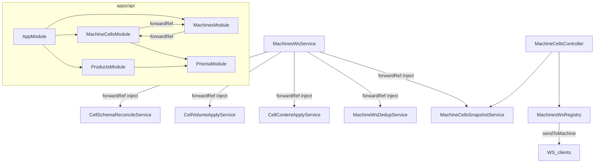
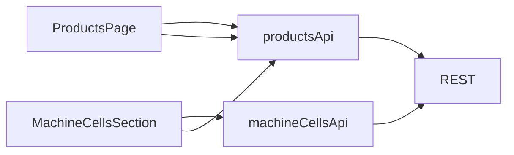

# Архитектура: инвентарь ячеек автомата (machine-cells-inventory)

**SessionId:** `machine-cells-inventory`  
**Repos:** `wiva-telemetry` (API, WS, web dashboard), `wiva-android` (автомат)  
**Источники:** утверждённое `tz.md`, `docs/FEATURE_MACHINE_CELLS_INVENTORY.md`, `AGENTS.md` обоих проектов.

## Границы и инварианты

- **Целевой протокол:** MVP WebSocket v2 + REST dashboard. **Не** расширять Shaker legacy (`cellStoreImportTopic`, `cellVolumeImportTopic`, merge-inventory).
- **Register не создаёт ячейки:** `POST /api/v1/machines/register` — только Machine; строки `machine_cells` появляются после `cells.schema.report`.
- **Flat-модель:** одна запись = одна физическая продуктовая ячейка; без cups/water/disposables/mixOfTastes.
- **Цены end-to-end:** `Int` копейки (WS, REST, PostgreSQL, Android) — **без** Decimal/float.
- **Объёмы:** `Int` мл, ≥ 0; валидация `0 <= blockVolume <= sosVolume <= maxVolume`.
- **tasteMediaKey:** строго 14 ключей из allowlist (канон Android: `ViwaElectronAssets.kt` → PNG/video).
- **Конфликт content (OQ-8):** per-cell `contentSource` (`MACHINE` | `DASHBOARD`); dashboard PATCH → `DASHBOARD` и блокирует apply product/prices с автомата; LWW по `updatedAt` — **только** между двумя `contentSource=MACHINE` content reports.
- **Denormalized product в snapshot (C-1):** downlink `cells.snapshot` и REST `CellDto` несут `productName`, `tasteMediaKey` per cell; uplink `cells.content.report` — только `productUuid` (+ prices/volumes).
- **Каталог продуктов на автомате (C-2):** snapshot downlink включает `products[]`; machine JWT **не** вызывает `GET /products`; refresh каталога после products CRUD — **lazy on next hello/schema report** (MVP).
- **Reconnect snapshot (MVP):** после `hello`, если server content/schema новее локального — downlink `cells.snapshot` с **полной заменой** `telemetryCellsSnapshot`.
- **Schema diff лишних ячеек:** soft `isActive=false` (OQ-1); новый uuid на том же `cellNumber` → deactivate old + insert new (OQ-2).
- **Web structural fields (MVP):** `maxVolume`, `blockVolume`, `sosVolume` — **read-only** на dashboard (OQ-3).
- **Volume на web (MVP):** PATCH с `volume` → `400 VOLUME_READ_ONLY`.
- **Legacy isolation:** при `useMvpProtocol=true` (default) Shaker cell topics остаются no-op (`skipLegacyTopic`); legacy path не ломается при `false`.
- **Docker:** не менять без явного согласия пользователя.

---

## Компоненты и ответственность

### wiva-telemetry — Backend (NestJS, `apps/api`)

| Комponent | Расположение (новое/расширение) | Ответственность |
|-----------|----------------------------------|-----------------|
| **Prisma schema** | `prisma/schema.prisma` | Модели `Product`, `MachineCell`, `MachineWsMessageDedup`; поля `Machine.cellSchemaHash`, `cellSchemaSyncedAt`, `cellsContentRevision` (см. ниже). |
| **ProductsModule** | `src/products/` | CRUD каталога продуктов; allowlist вкусов; валидация `tasteMediaKey`; DELETE с SetNull на ячейках (OQ-6). |
| **MachineCellsModule** | `src/machine-cells/` | GET/PATCH ячеек машины; DTO маппинг; authZ; side-effect push snapshot; **не** создаёт ячейки при register. |
| **CellSchemaReconcileService** | `src/machine-cells/cell-schema-reconcile.service.ts` | Алгоритм reconcile §5 brief/TZ; вычисление `schemaHash`; preserve volume/product/prices; soft deactivate; OQ-2 re-key. |
| **CellVolumeApplyService** | `src/machine-cells/cell-volume-apply.service.ts` | Volume-only UPDATE; optional block/sos (OQ-4); **никогда** не трогает product/prices. |
| **CellContentApplyService** | `src/machine-cells/cell-content-apply.service.ts` | Upsert content + optional volumes; **OQ-8/C-5:** per-cell `contentSource` gate; LWW между `MACHINE` reports по `sentAt`; volume always apply if present. |
| **MachineWsDedupService** | `src/machine-cells/machine-ws-dedup.service.ts` | Idempotency `(machineId, messageId)`; повтор → ack без apply. |
| **MachineCellsSnapshotService** | `src/machine-cells/machine-cells-snapshot.service.ts` | Сбор full snapshot (`products[]` + denormalized `CellFull[]`); reconnect compare по `clientSchemaHash` / `clientContentRevision` из schema report; триггер push после PATCH / reconcile. |
| **MachinesWsService** (расширение) | `src/machines/machines-ws.service.ts` | Protocol v2 `hello` + `supportedMessageTypes`; dispatch uplink types; post-schema-reconcile reconnect snapshot hook; cell apply services через `forwardRef`. |
| **MachinesWsRegistry** (расширение) | `src/machines/machines-ws.registry.ts` | **Экспорт из `MachinesModule`:** публичный `sendToMachine(machineId, envelope)` для push из REST/WS handlers (C-4 Variant B). |
| **MachinesModule** | `src/machines/machines.module.ts` | Экспорт `MachinesWsRegistry`; import `MachineCellsModule` через `forwardRef`; **не** дублировать products/cells controllers здесь. |
| **ExpiredRecordsCleanupService** (расширение) | `src/cleanup/expired-records.cleanup.ts` | TTL cleanup `machine_ws_message_dedup` (например 7 дней) по аналогии с sessions. |
| **AppModule** | `src/app.module.ts` | Import `ProductsModule`, `MachineCellsModule`. |

**Разделение REST vs WS:** products/cells REST — session cookie + `SessionAuthGuard` + `RolesGuard`. Machine JWT — только WS uplink; PATCH products/cells REST → 403.

### wiva-telemetry — Web (`apps/web`)

| Комponent | Расположение | Ответственность |
|-----------|--------------|-----------------|
| **ProductsPage** | `src/pages/ProductsPage.tsx` | Таблица CRUD «База продуктов»; select вкуса из allowlist; VIEWER read-only. |
| **MachineCellsSection** | `src/pages/MachineDetailPage.tsx` или `components/MachineCellsSection.tsx` | Секция «Ячейки»: таблица, product select, dosage prices (рубли в UI → копейки в API), индикаторы block/sos; polling 15–30 с. |
| **API client** | `src/api/client.ts` (+ types) | `productsApi`, `machineCellsApi`; обработка `VOLUME_READ_ONLY`, `INVALID_TASTE`. |
| **Routing / nav** | `App.tsx`, `Guards.tsx` (`AppShell`) | Route `/products`; пункт навигации «База продуктов» для всех ACTIVE ролей; мутации — OPERATOR+. |
| **Price helpers** | `src/utils/money.ts` (новый) | `kopecksToRublesDisplay`, `rublesInputToKopecks` — единая конвертация для UI. |
| **Role helpers** | `src/auth/roles.ts` | `canMutateProducts`, `canMutateCells` (OPERATOR, ADMIN, MASTER). |

### wiva-android — Domain / Data

| Комponent | Расположение | Ответственность |
|-----------|--------------|-----------------|
| **TelemetryCell** | `domain/model/TelemetryCell.kt` | Flat domain cell: uuid, cellNumber, productUuid, **productName**, **tasteMediaKey**, volumes, prices (Int kopecks). |
| **TelemetryProduct** | `domain/model/TelemetryProduct.kt` | `{ uuid, name, tasteMediaKey }` — элемент локального каталога из snapshot. |
| **TelemetryCellsSnapshot** | `domain/model/TelemetryCellsSnapshot.kt` | `{ schemaHash?, contentRevision?, products: List<TelemetryProduct>, cells: List<TelemetryCell>, savedAtEpochMs }` — единый локальный store (cells + catalog). |
| **TelemetryCellsRepository** | `domain/repository/` + `data/repository/` | Read/write JsonStore `telemetryCellsSnapshot`; atomic replace; Flow для UI. |
| **CellUuidAllocator** | `domain/telemetry/CellUuidAllocator.kt` | Генерация stable uuid при первой инициализации схемы на автомате (OQ-5); персист в snapshot. |
| **PhysicalCellSchemaProvider** | `domain/telemetry/` или hardware mock | Источник N ячеек, maxVolume для schema report (mock controller / конфиг машины). |
| **TasteMediaKeyCatalog** | `domain/catalog/TasteMediaKeyCatalog.kt` | 14 ключей + RU display; shared с product picker в service menu. |
| **TelemetryCellsMessageCodec** | `data/remote/telemetry/mvp/cells/` | Serialize/deserialize WS payloads v2 (`schema.report`, `volume.report`, `content.report`, `snapshot`). |
| **TelemetryCellsSyncCoordinator** | `data/remote/telemetry/mvp/TelemetryCellsSyncCoordinator.kt` | Оркестрация: post-hello schema report; volume/content uplink; apply snapshot; reconnect revision compare. |
| **MvpTelemetryWebSocketManager** (расширение) | существующий | Callback/downlink dispatch для `cells.snapshot`; делегирование в coordinator. |
| **SimpleTelemetryCoordinator** (расширение) | существующий | После `hello` → trigger schema report; wire coordinator lifecycle. |
| **TelemetryCellsSnapshotAdapter** | `domain/customer/` или `ui/screens/customer/` | Map snapshot → `DrinkContainer` для customer UI **без** legacy merge path. |
| **ViwaElectronAssets** | существующий | `horizontalCardImageUri(tasteMediaKey)`, `preparingVideoUri` — резолв PNG/video по ключу продукта. |

### wiva-android — UI (service menu + customer)

| Комponent | Расположение | Ответственность |
|-----------|--------------|-----------------|
| **ViwaInventoryVolumesTab** (рефактор) | `ui/screens/service/tabs/` | Edit volume → local snapshot → `cells.volume.report` (MVP path). |
| **ViwaTelemetryInventoryTab** (рефактор) | `ui/screens/service/tabs/` | Product picker из **локального** `snapshot.products[]`; edit product/prices → `cells.content.report` (uplink: `productUuid` only, без denormalized fields). |
| **ServiceViewModel** (расширение) | существующий | Bind snapshot Flow; block/sos индикация §3.1.1; gate legacy vs MVP inventory source. |
| **DrinkListViewModel** (расширение) | существующий | При `useMvpProtocol` — drink list из `TelemetryCellsSnapshotAdapter`, не `telemetryMergedInventory`. |
| **JsonStoreKeys** | `TELEMETRY_CELLS_SNAPSHOT = "telemetryCellsSnapshot"` | Новый ключ; legacy keys не удалять. |

### Cross-cutting

| Комponent | Ответственность |
|-----------|-----------------|
| **Contract doc (M7)** | `wiva-telemetry/docs/contracts/machine-cells-inventory.md` (+ ссылка из Android docs) — envelope types, REST, error codes, revision rules. |
| **Integration test (M7)** | `wiva-telemetry/apps/api` e2e: register → WS hello → schema → REST PATCH → snapshot received (mock WS client). |

---

## Интерфейсы и контракты

### WebSocket envelope (без изменения формы)

```json
{ "type": "...", "messageId": "uuid", "sentAt": "ISO-8601", "payload": {}, "correlationId": "?" }
```

**Protocol version:** `WS_PROTOCOL_VERSION = 2` (`crypto.util.ts`).  
**hello.payload (v2):**

```json
{
  "serialNumber": "VIWA-000004",
  "protocolVersion": 2,
  "heartbeatIntervalSeconds": 30,
  "supportedMessageTypes": [
    "hello", "heartbeat", "ack", "error",
    "cells.schema.report", "cells.volume.report", "cells.content.report",
    "cells.snapshot"
  ]
}
```

**Backward compatibility v1:** клиенты v1 игнорируют неизвестные поля в `hello`; сервер принимает v1 uplink (`heartbeat` only) без cell handlers. Cell types → `UNKNOWN_TYPE` для v1 clients допустимо или soft ignore — **не** ломать connect.

### Uplink (machine → server)

| type | payload | ack payload (success) |
|------|---------|------------------------|
| `cells.schema.report` | `{ schemaHash?, **clientSchemaHash?**, **clientContentRevision?**, cells: [{ uuid, cellNumber, maxVolume, blockVolume?, sosVolume? }] }` | `{ ok: true, schemaHash, created, updated, deactivated }` |
| `cells.volume.report` | `{ updates: [{ uuid, volume, blockVolume?, sosVolume? }] }` | `{ ok: true, applied: number }` (best-effort) |
| `cells.content.report` | `{ cells: [CellContentReport] }` | `{ ok: true, applied: number }` |

**CellContentReport** (uplink only — без denormalized product fields):

```json
{
  "uuid": "550e8400-e29b-41d4-a716-446655440000",
  "cellNumber": 1,
  "productUuid": "..." | null,
  "blockVolume": 0,
  "sosVolume": 100,
  "volume": 1200,
  "maxVolume": 5000,
  "dosage1Price": 9900,
  "dosage2Price": 14900
}
```

**CellFull** (downlink snapshot + REST `CellDto`; server join из `products`):

```json
{
  "uuid": "550e8400-e29b-41d4-a716-446655440000",
  "cellNumber": 1,
  "productUuid": "..." | null,
  "productName": "..." | null,
  "tasteMediaKey": "cherry" | null,
  "blockVolume": 0,
  "sosVolume": 100,
  "volume": 1200,
  "maxVolume": 5000,
  "dosage1Price": 9900,
  "dosage2Price": 14900
}
```

**Denormalization (C-1):** `MachineCellsSnapshotService` и REST GET cells заполняют `productName` / `tasteMediaKey` LEFT JOIN по `productUuid`. Uplink `cells.content.report` **не** принимает эти поля (ignore if present). Downlink `cells.snapshot` **всегда** denormalized per cell.

**Dedup:** перед apply — `MachineWsDedupService.tryAcquire(machineId, messageId)`. False → `ack { ok: true, deduplicated: true }`.

### Downlink (server → machine)

| type | Когда | payload |
|------|-------|---------|
| `cells.snapshot` | PATCH cells success + ONLINE; reconnect после schema reconcile если server новее (C-3) | `{ schemaHash, contentRevision, **products**, cells }` — см. ниже |
| `cells.volume.patch` | **v1**, не MVP | `{ updates: [{ uuid, volume }] }` |

**`cells.snapshot` payload (C-1 + C-2):**

```json
{
  "schemaHash": "sha256-hex",
  "contentRevision": 42,
  "products": [
    { "uuid": "...", "name": "Вишня", "tasteMediaKey": "cherry" }
  ],
  "cells": [ /* CellFull[] — denormalized */ ]
}
```

- **`products[]`:** полный каталог продуктов tenant (или scoped subset — MVP: **все** `Product` rows, т.к. picker на автомате нужен полный список). Обновляется вместе с каждым snapshot после PATCH cells.
- **Products CRUD refresh (C-2, MVP):** после POST/PATCH/DELETE `/products` сервер **не** push snapshot немедленно; ONLINE machines получат обновлённый `products[]` при **следующем reconnect** (`hello` → `cells.schema.report` с `clientContentRevision` / `clientSchemaHash` → server push snapshot если server новее). Lazy policy выбрана для простоты MVP.
- **MVP snapshot semantics:** клиент **полностью заменяет** `telemetryCellsSnapshot` (включая `products[]`) — без merge с локальным edit-in-progress.

### REST (`/api/v1`, session cookie)

| Method | Path | Roles | Notes |
|--------|------|-------|-------|
| GET | `/products` | ACTIVE (all) | `{ items: ProductDto[] }` |
| POST | `/products` | OPERATOR+ | `{ name, tasteMediaKey }` → 400 `INVALID_TASTE` |
| PATCH | `/products/:id` | OPERATOR+ | partial update |
| DELETE | `/products/:id` | OPERATOR+ | SetNull cells → delete; 204 |
| GET | `/products/tastes` | ACTIVE | `{ items: [{ mediaKey, nameRu }] }` — 14 keys |
| GET | `/machines/:id/cells` | ACTIVE | `{ schemaHash, contentRevision, updatedAt, items: CellDto[] }` |
| PATCH | `/machines/:id/cells` | OPERATOR+ | `{ cells: [{ uuid, productUuid?, dosage1Price?, dosage2Price? }] }` — **volume запрещён** |

**CellDto (REST):** uuid, cellNumber, productUuid, productName, tasteMediaKey, blockVolume, sosVolume, volume, maxVolume, dosage1Price, dosage2Price, isActive, updatedAt.

**Error codes:** `INVALID_TASTE`, `VOLUME_READ_ONLY`, `CELL_NOT_FOUND`, `INVALID_THRESHOLDS`, стандартные 403 для VIEWER / machine JWT на REST.

### Dashboard PATCH vs content report (OQ-8, C-5)

**Поле `contentSource` на `MachineCell`:** enum `MACHINE` | `DASHBOARD`; default `MACHINE` при INSERT.

| Шаг | Действие |
|-----|----------|
| **1. Dashboard PATCH cells** | Для каждой затронутой ячейки: update `productId`, `dosage1Price`, `dosage2Price`; set **`contentSource = DASHBOARD`**; bump **`Machine.cellsContentRevision++`**; update `cell.updatedAt`. Push snapshot если ONLINE. |
| **2. `cells.content.report`** | Per-cell apply по `contentSource`: |
| | **`DASHBOARD`:** **не применять** `productUuid`, `dosage1Price`, `dosage2Price` с автомата. **Применять** `volume` если поле присутствует в payload (always apply volume from content report). **Применять** `blockVolume` / `sosVolume` / `maxVolume` если присутствуют. |
| | **`MACHINE`:** apply все content-поля (`productUuid`, prices) + optional volumes/structural из report. |
| **3. LWW между machine reports** | Только если **`contentSource == MACHINE`** для обеих сторон конфликта: LWW по `sentAt` envelope / server `now()` при apply. |
| **4. Unpin (MVP)** | Явного unpin **нет**. Новый dashboard PATCH перезаписывает content и снова ставит `contentSource = DASHBOARD`. Единственный путь вернуть machine authority — v1 (не MVP). |

**`CellContentApplyService`:** единственный owner алгоритма выше; не смешивать с revision-only gate.

### Reconnect snapshot (MVP, C-3)

**Handshake:** uplink `cells.schema.report` включает client state:

```json
{
  "schemaHash": "...",
  "clientSchemaHash": "..." | null,
  "clientContentRevision": 41 | null,
  "cells": [ /* structural only */ ]
}
```

Android заполняет `clientSchemaHash` / `clientContentRevision` из последнего сохранённого `telemetryCellsSnapshot` (null если store пуст).

**`MachineCellsSnapshotService.shouldPushSnapshotAfterSchemaReport`:**

1. Выполнить schema reconcile (как сейчас).
2. Прочитать server `Machine.cellSchemaHash`, `Machine.cellsContentRevision`.
3. Push `cells.snapshot` **если выполняется хотя бы одно:**
   - `server.cellsContentRevision > (clientContentRevision ?? -1)`, **или**
   - structural/content-relevant schema change: `server.cellSchemaHash != clientSchemaHash` (client null → push), **или**
   - client store пуст / first connect (`clientContentRevision == null && clientSchemaHash == null`) и в БД есть active cells.
4. Push **после** schema ack (uuid exist in DB); envelope через `MachinesWsRegistry.sendToMachine`.

**Android `TelemetryCellsSyncCoordinator`:** после `hello` always send schema report (или при изменении локальной схемы); on snapshot downlink — atomic replace store including `products[]`; persist `contentRevision` / `schemaHash` for next reconnect.

### AuthZ matrix

| Актёр | Products REST | Cells REST | WS uplink |
|-------|---------------|------------|-----------|
| VIEWER | GET | GET | — |
| OPERATOR+ | CRUD | GET/PATCH | — |
| **Machine JWT** | **403** | **403** | schema/volume/content (**не** GET /products, C-2) |
| Machine JWT REST | 403 | 403 | — |

---

## Модели данных

### PostgreSQL / Prisma

Канон из TZ §3.2 / FEATURE §3.2:

- **Product:** `id` (uuid), `name`, `tasteMediaKey`, timestamps.
- **MachineCell:** `id` = **uuid с автомата** (не server `@default(uuid())`); FK `machineId`, `cellNumber`, `productId?`, volumes/prices Int, **`contentSource` enum `MACHINE` | `DASHBOARD` @default(MACHINE)**, `isActive`, `schemaRevision`, timestamps.
- **MachineWsMessageDedup:** composite PK `(machineId, messageId)`, `receivedAt`.
- **Machine** (extend): `cellSchemaHash String?`, `cellSchemaSyncedAt DateTime?`, `cellsContentRevision Int @default(0)`.

**Индексы:** `(machineId, isActive)`, `(machineId, cellNumber)` unique, `(productId)`.

### Domain (Android)

```kotlin
// TelemetryCell — mirrors CellFull (downlink / local store after snapshot)
data class TelemetryCell(
    val uuid: String,
    val cellNumber: Int,
    val productUuid: String?,
    val productName: String?,
    val tasteMediaKey: String?,
    val blockVolume: Int,
    val sosVolume: Int,
    val volume: Int,
    val maxVolume: Int,
    val dosage1Price: Int?,
    val dosage2Price: Int?,
)

data class TelemetryProduct(
    val uuid: String,
    val name: String,
    val tasteMediaKey: String,
)

data class TelemetryCellsSnapshot(
    val schemaHash: String?,
    val contentRevision: Int?,
    val products: List<TelemetryProduct>,
    val cells: List<TelemetryCell>,
    val savedAtEpochMs: Long,
)
```

**Uplink codec:** `CellContentReport` — subset без `productName` / `tasteMediaKey`. **Downlink codec:** full snapshot с `products[]` + denormalized cells.

### Allowlist tasteMediaKey (14)

Канон API = канон `ViwaElectronAssets.MEDIA_KEY_TO_PNG`:

`cherry`, `blackberry-lime`, `coconut`, `cucumber`, `grapefruit`, `lemon`, `lime`, `lime-mint`, `orange`, `peach-mango`, `pomegranate-blueberry`, `raspberry`, `strawberry-lemongrass`, `watermelon`.

Backend: константа `TASTE_MEDIA_KEYS` + RU labels map (shared module or duplicate in web from API `/products/tastes`).

### schemaHash algorithm

```
SHA-256( canonical JSON of sorted-by-cellNumber array of { uuid, cellNumber, maxVolume } )
```

Persist на `Machine.cellSchemaHash` после каждого успешного reconcile.

### Defaults при INSERT (новая ячейка)

`volume=0`, `productId=null`, `dosage1Price=null`, `dosage2Price=null`, `blockVolume=0`, `sosVolume=0`, `isActive=true`, **`contentSource=MACHINE`**.

---

## Интеграции и потоки

### UC-1: Register + schema reconcile

```
Android --POST /register--> API (Machine only, 0 cells)
Android --WS connect JWT--> MachinesWsService
Server --hello v2--> Android
Android --cells.schema.report { clientSchemaHash, clientContentRevision, cells[] }--> CellSchemaReconcileService --> DB
Server --ack { schemaHash, counts }--> Android
Server --cells.snapshot? (if server newer, C-3)--> Android
Android --cells.content.report (recommended, CellContentReport)--> CellContentApplyService
```

**Invariant:** reconcile **не** сбрасывает volume/product/prices существующих uuid.

### UC-2: Physical schema change

Trigger: `cells.schema.report` с изменённым набором/uuid/maxVolume.

- uuid match → update structural, preserve content/volume.
- same cellNumber, new uuid → deactivate old, insert new (OQ-2).
- missing in report → `isActive=false` (OQ-1).

### UC-3: Volume sync (high frequency)

```
Service menu Volumes tab / future cook
  → update local snapshot
  → cells.volume.report (fire-and-forget, UI не ждёт ack)
  → CellVolumeApplyService UPDATE volume (+ optional block/sos)
Web polling GET /cells ← eventual consistency 15–30s
```

### UC-4: Content from device

```
Inventory tab edit (product picker ← snapshot.products[])
  → cells.content.report (CellContentReport: productUuid + prices + volumes; no denormalized fields)
  → CellContentApplyService (OQ-8 / contentSource algorithm)
  → server join product → next snapshot downlink carries productName/tasteMediaKey
```

### UC-5: Products CRUD (web)

```
ProductsPage → REST /products*
DELETE → SetNull productId on cells → delete product
MVP (C-2): no immediate WS push; machines refresh products[] on next reconnect snapshot
```

### UC-6: Web cells edit + push

```
MachineCellsSection → PATCH /machines/:id/cells (no volume)
  → DB update + contentSource=DASHBOARD + cellsContentRevision++
  → if MachinesWsRegistry.hasActiveConnection → cells.snapshot (products[] + denormalized cells)
Android TelemetryCellsSyncCoordinator → full replace snapshot (products + cells)
  → ServiceViewModel + DrinkListViewModel refresh
  → tasteMediaKey → ViwaElectronAssets PNG/video (from cell or products catalog)
```

### UC-7: Reconnect snapshot

```
WS reconnect → hello v2
  → cells.schema.report { clientSchemaHash, clientContentRevision, cells[] }
  → CellSchemaReconcileService + MachineCellsSnapshotService.shouldPushSnapshotAfterSchemaReport
  → if server newer → cells.snapshot downlink (after schema ack)
Android replace telemetryCellsSnapshot (products[] + cells)
```

### UC-8: Customer drink list (MVP path)

```
useMvpProtocol=true:
  DrinkListViewModel ← TelemetryCellsSnapshotAdapter(snapshot)
useMvpProtocol=false:
  legacy merge path (unchanged)
```

### Module dependency (backend, C-4 Variant B)

**Выбранный паттерн:** `MachinesModule` экспортирует `MachinesWsRegistry` с публичным `sendToMachine(machineId, envelope)`. WS dispatch остаётся в `MachinesWsService`; cell apply services живут в `MachineCellsModule`. Цикл разрывается через **`forwardRef`** на обоих import-ах.

**Import graph (однозначно, без цикла at bootstrap):**

| Module | imports | exports |
|--------|---------|---------|
| `MachinesModule` | `forwardRef(() => MachineCellsModule)`, `PrismaModule`, … | **`MachinesWsRegistry`**, `MachinesWsService` (internal) |
| `MachineCellsModule` | `forwardRef(() => MachinesModule)`, `ProductsModule`, `PrismaModule` | `CellSchemaReconcileService`, `CellVolumeApplyService`, `CellContentApplyService`, `MachineCellsSnapshotService`, `MachineWsDedupService` |

**Runtime wiring:**

- `MachinesWsService` — `@Inject(forwardRef(() => CellSchemaReconcileService))` и аналогично для volume/content/snapshot/dedup.
- `MachineCellsController` / `MachineCellsSnapshotService` — inject `MachinesWsRegistry` для push после PATCH.
- **Не** создавать `MachineCellsWsModule` (Variant A) и **не** использовать domain events (Variant C) в MVP.



### Web data flow



---

## Рекомендации по параллелизации

Волны из TZ M1–M7. Зависимости и безопасные параллельные треки:

| Волна | Repo | Deliverable | Зависит от | Параллельно с |
|-------|------|-------------|------------|---------------|
| **M1** | wiva-telemetry | Prisma migration + models + dedup table + Machine fields | — | — (старт) |
| **M2** | wiva-telemetry | REST products + cells (без WS push) | M1 | M4 (mock API / MSW) |
| **M3** | wiva-telemetry | WS v2 handlers, reconcile, dedup, snapshot push, reconnect | M1, M2 (PATCH для push trigger) | M6 (контракт types frozen после draft contract) |
| **M4** | wiva-telemetry/web | ProductsPage + nav + API client | M2 (или mock) | M2 backend, M5 |
| **M5** | wiva-telemetry/web | MachineDetail «Ячейки» section | M2, желательно M3 для E2E smoke | M4, M6 |
| **M6** | wiva-android | snapshot store, schema/volume/content uplink, snapshot apply, UI tabs, drink adapter | Contract draft из M2/M3 (types stable) | M3 после freeze envelope |
| **M7** | both | Contract doc + integration/E2E test | M3, M5, M6 | — (финал) |

### Рекомендуемое разбиение команд

1. **Track A (telemetry backend):** M1 → M2 → M3 последовательно; один developer.
2. **Track B (telemetry web):** после M2 API freeze — M4 и M5 параллельно (разные pages).
3. **Track C (android):** после согласования contract stub (конец M2):
   - C1: domain models + JsonStore + codec (unit tests),
   - C2: coordinator + WS integration (depends M3 server stub or testcontainers),
   - C3: service menu tabs + customer adapter (parallel with C2 once snapshot API defined).
4. **Gate M7:** один integration scenario на staging — register → schema → web product → PATCH cell → snapshot on device → volume report → web polling.

### Contract freeze point

После M2 + начала M3 зафиксировать `docs/contracts/machine-cells-inventory.md` (types incl. C-1 denormalized fields, C-2 `products[]`, C-3 handshake fields, C-5 `contentSource`, error codes) — Android M6 и web M5 могут идти параллельно против frozen contract.

### Риски параллелизации

| Риск | Mitigation |
|------|------------|
| Drift WS payload между Android и API | Contract doc + shared JSON fixtures in `apps/api/test/fixtures/cells/` |
| Web до готовности push | M5 работает against REST only; snapshot verified in M7 |
| Reconnect revision unclear | MVP: `clientContentRevision` / `clientSchemaHash` в schema report + `contentRevision` в snapshot (C-3) |
| Android product picker без REST | Snapshot `products[]` + lazy refresh after products CRUD on reconnect (C-2) |
| Legacy regression | Android: все изменения за `useMvpProtocol`; CI unit tests both flags |

### Не параллелить

- M3 push snapshot **до** M2 PATCH cells endpoint (need trigger).
- M6 WS uplink E2E **до** M3 handlers (можно unit-test codec раньше).
- M7 **до** M3+M5+M6 minimal paths.

---

## Политики MVP (зафиксировано)

| ID | Политика |
|----|----------|
| OQ-1 | Soft deactivate: `isActive=false` |
| OQ-2 | New uuid same cellNumber → deactivate old, insert new |
| OQ-3 | Web structural read-only |
| OQ-4 | block/sos optional in volume report |
| OQ-5 | uuid generated on Android |
| OQ-6 | DELETE product → SetNull cells + hard delete |
| OQ-7 | Volume ack best-effort |
| OQ-8 | **`contentSource` per-cell:** `DASHBOARD` блокирует apply product/prices с автомата; LWW только между `MACHINE` reports (C-5) |
| OQ-9 | Initial content report recommended, not blocking |
| OQ-10 | Hard delete products |
| — | Reconnect snapshot when server newer |
| — | Snapshot downlink = full replace |
| — | Int kopecks everywhere |
| — | 14 tasteMediaKey allowlist |
| C-1 | Denormalized `productName` / `tasteMediaKey` in snapshot downlink; uplink content report — `productUuid` only |
| C-2 | Snapshot `products[]`; machine JWT no REST products; products CRUD refresh **lazy on next hello/schema report** |
| C-3 | Schema report handshake: `clientSchemaHash`, `clientContentRevision`; push if server newer |
| C-4 | Nest **Variant B:** export `MachinesWsRegistry.sendToMachine` + `forwardRef` both modules |
| C-5 | `contentSource` enum + per-cell apply algorithm (см. § Dashboard PATCH vs content report) |

---

## Verification (architect → planner/dev)

| Область | Минимум |
|---------|---------|
| wiva-telemetry | `npm test` — reconcile, dedup, REST authZ, WS handlers; unit: snapshot denormalization join, `shouldPushSnapshotAfterSchemaReport`, OQ-8 per-cell apply, Nest `forwardRef` bootstrap; integration e2e M7 |
| wiva-telemetry web | `npm run lint`, `npm run build`; smoke WEB-1..WEB-7 из TZ |
| wiva-android | Unit: snapshot replace incl. `products[]`, codec uplink vs downlink, `contentSource` conflict mocks, reconnect handshake fields; `gradlew.bat :app:testDebugUnitTest` |
| Manual | ONLINE PATCH → snapshot ≤5s; reconnect snapshot; VIEWER read-only; inventory picker from local `products[]` |

---

## Связанные артефакты

| Документ | Назначение |
|----------|------------|
| `tz.md` | Утверждённое ТЗ |
| `docs/FEATURE_MACHINE_CELLS_INVENTORY.md` | Brief + reconcile algorithm |
| `wiva-telemetry/docs/contracts/registration-machine-jwt.md` | JWT + WS v1 baseline |
| `wiva-android/docs/SIMPLE_TELEMETRY_MVP_ANDROID.md` | Android MVP telemetry |
| `wiva-android/.../ViwaElectronAssets.kt` | tasteMediaKey → assets |
